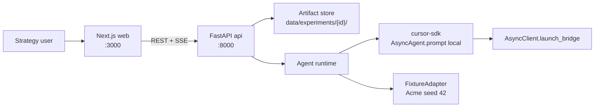
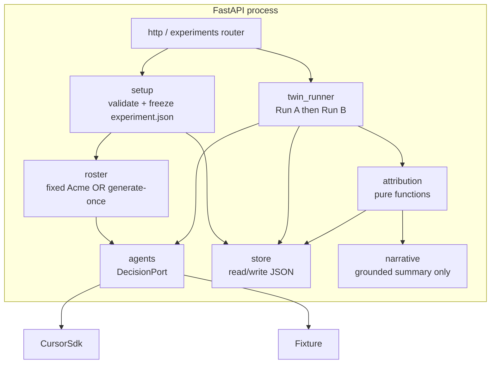
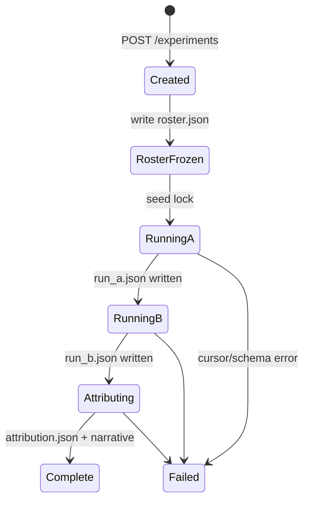
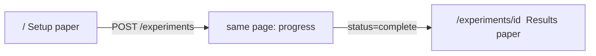
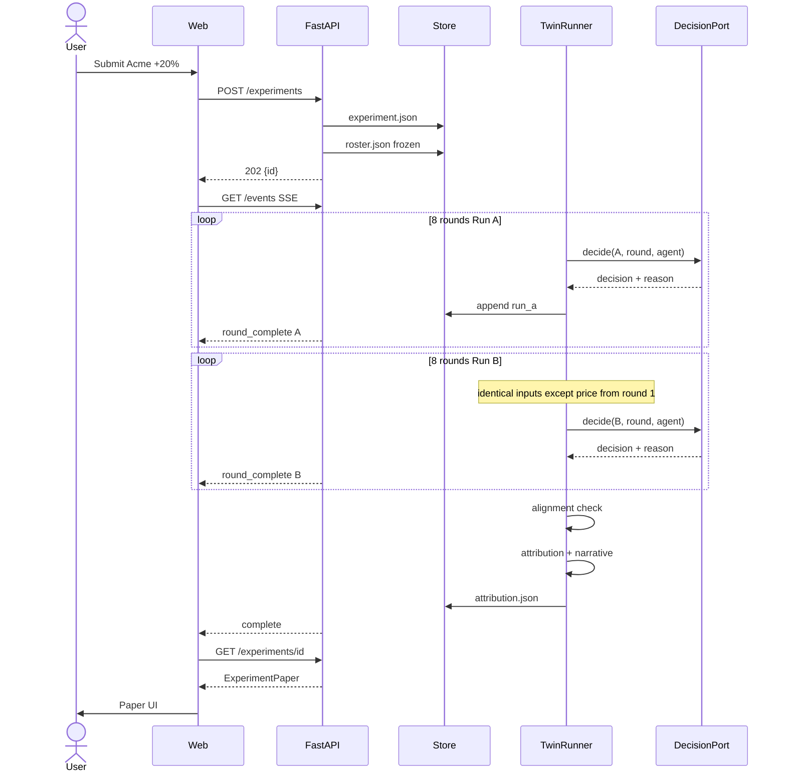

# Counterfactual Replay — System Architecture & Team Plan

**Audience:** 4 engineers, one-day hackathon  
**Companion docs:** [`counterfactual-replay-spec.md`](counterfactual-replay-spec.md) (product + causal contract), [`DESIGN-Guide.md`](DESIGN-Guide.md) (web UI system)  
**Live inference:** [Cursor Python SDK](https://cursor.com/docs/sdk/python) (`cursor-sdk`) — not a direct Grok HTTP client. Spec language about Grok 4.6 is the product metaphor; this architecture binds every live decision to `AsyncAgent.prompt`.  
**Scope:** Layer 1 only — twin-run engine, frozen artifacts, inspectable paper UI. No calibration, no experiment grid, no Shapley.

This document is the build contract. If two tracks disagree, this file plus the spec win. Do not invent a second architecture during the day.

---

## 0. How to read this

| If you are… | Read first | Then own |
|---|---|---|
| **A — Agent Runtime** | §5, §6, ADR-3, ADR-7 | Cursor SDK adapter, prompts, personas, one-round I/O |
| **B — Twin Engine + API** | §4, §7, §8, §9 | Twin runner, artifacts, attribution, HTTP |
| **C — Setup & Shell** | §10, DESIGN-Guide | Tokens, app chrome, setup form, receipt, run progress |
| **D — Results Paper** | §10, §8, DESIGN-Guide | Metric cards, charts, attribution bars, click-through trace |
| **Everyone, first 45 min** | §1–§3, §11, §13 | Shared types, fixture, “hello world” vertical slice |

---

## 1. Goal and non-goals

### Goal

A user defines a product and **one** intervention. The system freezes a market of agents, runs it twice with a locked seed (baseline vs counterfactual), and returns an inspectable causal paper: two trajectories, named contributors, clickable reasons, and a visible “0 other variables changed” receipt.

### Non-goals (hackathon)

- Auth, multi-user, billing
- Postgres / Redis / queues / k8s
- Historical calibration or CSV upload
- More than one live intervention type (`price_change` only)
- Shapley / leave-one-out attribution
- Mobile-native apps

### Hard constraints (from spec)

- 3 roles in the default roster (buyers, competitor, analyst)
- 8 rounds
- 1 variable changed
- Acme Analytics fixture, seed `42`, prepared in advance
- Generate-once / freeze / reuse for roster and prompts
- Live decisions via Cursor SDK (`cursor-sdk`), not a raw model HTTP client
- UI follows `DESIGN-Guide.md` — no parallel palette

---

## 2. Architecture decisions

### ADR-1 — Modular monolith, two processes

**Decision:** One repo, two runtimes: Next.js (web) + FastAPI (api). Not microservices. Not a Next.js-only app.

**Why:** Four people. Backend simulation is IO-bound on Cursor agent runs and must not live inside React. Frontend can ship against a frozen OpenAPI contract. A single Next.js process would serialize the two frontend tracks onto the same app-router merge conflicts *and* block backend work on Node. The Python SDK (`cursor-sdk`) lives next to `DecisionPort` in FastAPI; do not call `@cursor/sdk` from the Next.js app.

**Trade-off:** Two `localhost` ports. Accept it. CORS allow `http://localhost:3000`.

### ADR-2 — Filesystem artifacts, not a database

**Decision:** Each experiment is a directory of JSON files. No Postgres.

**Why:** The product *is* the scientific record (`experiment.json`, `roster.json`, `run_a.json`, `run_b.json`, `attribution.json`). A database would hide the claim. Replay = read the directory.

**When to revisit:** Multi-user product (layer 4). Not today.

### ADR-3 — Hexagonal agent runtime

**Decision:** Domain code never imports `cursor_sdk`. Agents talk to a `DecisionPort`. Adapters: `CursorSdkAdapter` (live) and `FixtureAdapter` (offline / tests / demo fallback).

**Why:** Cursor agent runs will flake, rate-limit, or hang. The causal pipeline and the UI must be demoable from frozen JSON. The fixture adapter is not cheating if it is labeled; a live run that cannot re-run is.

### ADR-4 — REST + SSE, not WebSockets

**Decision:** `POST /experiments` starts a run. `GET /experiments/{id}` returns the paper when `status=complete`. `GET /experiments/{id}/events` is Server-Sent Events for round progress.

**Why:** One long job (tens of Cursor `Agent.prompt` runs). Polling is ugly; WebSockets are extra moving parts. SSE is enough for “Round 4 / 8 · Run B”.

### ADR-5 — Shared contract package, generated once

**Decision:** Pydantic models in `api/` are the source of truth. FastAPI emits OpenAPI. Frontend consumes generated TypeScript types (`openapi-typescript` or a checked-in `contracts.ts` if generation is too slow).

**Why:** Four people cannot verbally share JSON shapes. The first 45 minutes freeze `contracts.ts` even if codegen is not wired.

### ADR-6 — Design system is law for web

**Decision:** All UI in `web/` follows `DESIGN-Guide.md` and `.cursor/rules/website-design.mdc`. Tokens live in `web/src/styles/tokens.css`. No Tailwind default blue, no shadows, no coral CTAs.

### ADR-7 — Cursor SDK for every live decision

**Decision:** Live market agents are Cursor local agents, orchestrated from FastAPI with the **Python** SDK (`pip install cursor-sdk`). Runtime is **local**, invoked with `AsyncAgent.prompt` **once per decision**. Built-in tools are disabled (`tools=[]`) so the model can only return JSON text.

**Why these three knobs:**

1. **Python, not TypeScript.** `DecisionPort` and the twin runner already live in `api/`. A second Node agent process would split causality across two runtimes.
2. **`AsyncAgent.prompt`, not `create` + `send`.** Durable agents keep conversation memory. Memory across rounds — or worse, across Run A and Run B — breaks the causal claim. One-shot prompt creates, runs, waits, and disposes. Isolation is the method.
3. **Local + `tools=[]`.** `cwd` is an isolated scratch directory per decision. No ambient `setting_sources`. No file edits to `run_a.json`. The experiment record is written only by `store.py`.

**Auth:** pass `api_key=` explicitly from settings (do not rely on ambient `CURSOR_API_KEY` in the request path). Key from [Cursor Dashboard → API Keys](https://cursor.com/dashboard/api).

**Model:** required for local. Default `composer-2.5`. Override with `CURSOR_MODEL`. At process boot, `Cursor.models.list()` and fail fast if the id is missing. Do not hardcode unlisted ids.

**Determinism honesty:** Cursor local agents do not expose Grok-style `temperature=0` + numeric seed. Identical prompts and frozen roster are still mandatory. If two fixture-free Run A’s diverge, disclose variance on the receipt and stop saying “provably caused.” FixtureAdapter remains the bit-identical path.

Docs: [Cursor Python SDK](https://cursor.com/docs/sdk/python).

---

## 3. System context



Trust boundary: the browser never calls Cursor. `CURSOR_API_KEY` stays on the backend. The web app only ever sees frozen artifacts and progress events.

---

## 4. Logical modules

One FastAPI process, four modules. Modules talk only through public functions / Pydantic types — never by reaching into each other’s internals. This is a modular monolith, not four services.



| Module | Responsibility | Must not do |
|---|---|---|
| `setup` | Validate input, lock seed, write `experiment.json` | Call Cursor, compute metrics |
| `roster` | Emit frozen `roster.json` (fixed first, generated later) | Differ between run A and run B |
| `agents` | One decision per agent per round, schema-valid JSON | Mutate market state |
| `twin_runner` | Apply intervention only to B from `applies_from_round`, drive 8 rounds × 2 | Invent attribution text |
| `attribution` | Divergence, weights, normalize to 100% | Call Cursor |
| `narrative` | 1–2 sentences citing stored reasons | Add claims not in logs |
| `store` | Atomic write of artifacts, load by id | Business logic |
| `http` | Auth-less REST + SSE | Simulation internals |

Frontend modules (Next.js) are pages + design-system components, not a second domain layer. The paper view is a renderer of `ExperimentPaper`. It does not recompute causality.

---

## 5. Repository layout

```
/
├── counterfactual-replay-spec.md
├── DESIGN-Guide.md
├── architecture.md                  ← this file
├── api/
│   ├── pyproject.toml               # fastapi, pydantic, cursor-sdk
│   ├── app/
│   │   ├── main.py                  # FastAPI app, CORS
│   │   ├── settings.py              # CURSOR_API_KEY, CURSOR_MODEL, DATA_DIR
│   │   ├── contracts.py             # Pydantic source of truth
│   │   ├── http/
│   │   │   └── experiments.py       # routes + SSE
│   │   ├── setup.py
│   │   ├── roster/
│   │   │   ├── fixed_acme.py        # P0 fixture
│   │   │   └── generate.py          # P1, skip if late
│   │   ├── agents/
│   │   │   ├── port.py              # DecisionPort
│   │   │   ├── cursor_adapter.py    # CursorSdkAdapter (AsyncAgent.prompt)
│   │   │   ├── fixture.py
│   │   │   ├── prompts.py
│   │   │   └── schemas.py           # JSON schema the prompt must return
│   │   ├── cursor_client.py         # process-level AsyncClient.launch_bridge
│   │   ├── twin_runner.py
│   │   ├── market.py                # state + metrics
│   │   ├── attribution.py
│   │   ├── narrative.py
│   │   └── store.py
│   └── tests/
│       ├── test_attribution.py
│       ├── test_twin_determinism.py
│       └── test_narrative_grounding.py
├── web/
│   ├── package.json
│   ├── src/
│   │   ├── app/
│   │   │   ├── layout.tsx
│   │   │   ├── page.tsx             # setup
│   │   │   └── experiments/[id]/page.tsx
│   │   ├── styles/tokens.css
│   │   ├── components/              # DESIGN-Guide components only
│   │   ├── lib/api.ts
│   │   └── types/contracts.ts       # frozen shared types
│   └── public/
└── data/
    └── experiments/
        └── acme-seed-42/            # checked-in golden paper for UI
            ├── experiment.json
            ├── roster.json
            ├── run_a.json
            ├── run_b.json
            └── attribution.json
```

**Golden paper:** Person B (or A+B) checks in `data/experiments/acme-seed-42/` as soon as a plausible twin-run exists — even from `FixtureAdapter`. Person D builds the entire dashboard against this folder and never waits on live Cursor.

---

## 6. Agent runtime (Person A)

### 6.1 Roles (fixed roster, build first)

| Agent id | Role | Count | Observes | Decides |
|---|---|---|---|---|
| `buyer_{1..n}` | Buyer | 5 for demo (subset of 30-weight market) | own WTP, loyalty, current price, competitor price, status | `stay` / `churn` / `switch` |
| `competitor` | Incumbent | 1 | your price, share trend | `hold` / `undercut` / `match` |
| `analyst` | Meta, not a participant | 1 | full round history | `note` — one-line causal flag, weight 0 in attribution |

**Market size vs instantiated callers:** spec says 30 addressable buyers. For latency, instantiate **5 Cursor buyer agents** whose decisions are weighted to represent bands of the 30 (e.g. buyer_1 weight 8, …). Document weights in `roster.json`. Do not silently spawn 30 live `Agent.prompt` runs on demo day.

WTP must straddle $59. At least three buyers sit in `$50–$58`. That band *is* the plot.

### 6.2 DecisionPort

```python
class DecisionPort(Protocol):
    async def decide(self, request: AgentDecisionRequest) -> AgentDecision:
        """Isolated one-shot. Reject empty/generic reasons."""
```

`AgentDecisionRequest` is the spec §5.2 JSON plus `run_id: "A" | "B"` and `agent_id`. Non-intervention fields for a given `(agent_id, round)` must be **byte-identical** across A and B until `applies_from_round`. The twin runner is responsible for that. The adapter must not add extra entropy (no conversation memory, no extra prompt wrapping).

Port is **async**. FastAPI and `cursor-sdk` async surfaces stay on one event loop. Do not call sync `Agent.prompt` from a thread pool “to make it work” — mix of sync/async clients is forbidden.

### 6.3 Process-level Cursor client

One `AsyncClient` per API process, created at startup, closed at shutdown. There is no global async default client.

```python
# app/cursor_client.py
from cursor_sdk import AsyncClient

async def lifespan(app):
    async with await AsyncClient.launch_bridge(workspace=settings.DATA_DIR) as client:
        app.state.cursor = client
        yield
```

Use `await client.agents.create(...)` or `await AsyncAgent.prompt(..., client=client)`. Pass `client=` on every prompt. Never mix this client with sync `Agent` / `CursorClient` in the same path.

Log `agent.agent_id` and `run.id` immediately after `send` / as soon as `prompt` returns, before parsing JSON. If a run hangs, those IDs are what you inspect via `Agent.get_run`.

### 6.4 CursorSdkAdapter

Invocation pattern: **`AsyncAgent.prompt` (one-shot)**. Not durable `create` + `send`. Each decision is a new agent so Run A cannot leak into Run B and round N cannot leak into round N+1.

```python
from cursor_sdk import (
    AgentOptions,
    AsyncAgent,
    CursorAgentError,
    LocalAgentOptions,
)

async def decide(self, request: AgentDecisionRequest) -> AgentDecision:
    scratch = experiment_scratch(request)  # data/experiments/{id}/scratch/{run}/{round}/{agent_id}
    scratch.mkdir(parents=True, exist_ok=True)
    prompt = render_decision_prompt(request)  # identical template A vs B; only JSON payload differs
    try:
        result = await AsyncAgent.prompt(
            prompt,
            AgentOptions(
                api_key=settings.CURSOR_API_KEY,  # explicit, not ambient
                model=settings.CURSOR_MODEL,      # default composer-2.5
                name=f"{request.experiment_id}:{request.run_id}:r{request.round}:{request.agent_id}",
                tools=[],                         # text only — cannot edit artifacts
                local=LocalAgentOptions(cwd=str(scratch)),  # explicit local; do not omit
                # setting_sources omitted on purpose: inline config only
            ),
            client=self.client,
        )
    except CursorAgentError as err:
        # Run never started (auth, config, network). Retry only if err.is_retryable.
        # Honor err.retry_after if present.
        raise DecisionStartupError(err) from err

    if result.status == "error":
        # Run started and failed. Do not retry blindly (duplicate agents).
        raise DecisionRunError(result.id)

    decision = parse_and_validate_json(result.result)  # decision, reason, confidence
    return decision
```

| Setting | Value |
|---|---|
| Package | `cursor-sdk` (Python). Docs: https://cursor.com/docs/sdk/python |
| Runtime | **Local**, always pass `local=LocalAgentOptions(cwd=...)` |
| Pattern | `AsyncAgent.prompt` — create, one prompt, wait, dispose |
| Model | `composer-2.5` unless `CURSOR_MODEL` override; validate with `Cursor.models.list()` at boot |
| Tools | `tools=[]` — no shell, no edit, no MCP; JSON in `result.result` |
| Settings | Do **not** set `setting_sources` (no project/user/team leak into the market agent) |
| Auth | `api_key=settings.CURSOR_API_KEY` on every call |
| Isolation cwd | `data/experiments/{id}/scratch/{run_id}/r{round}/{agent_id}/` empty except optional `request.json` copy for debug |
| Prompt hash | SHA-256 of the **template** (not the per-agent JSON); stored on `experiment.json` |
| Retry | Startup: only if `err.is_retryable`, honor `retry_after`. Run failure: no retry unless we mint a new idempotent decision with the same prompt (still a new agent). Max 1 repair prompt if JSON invalid / reason denylisted, then fail the experiment |

Parse `result.result` as JSON. Strip a wrapping markdown fence if present. Reject `reason` empty, shorter than 40 chars, or denylist (`"I decided to churn"`, `"Because of the price"`). One repair `AsyncAgent.prompt` with the schema echoed; if still bad, fail loudly. Do not silently substitute.

**Do not** use `Agent.create` + multi-turn `send` for market decisions. Follow-ups keep conversation context; that is contamination.

**Do not** use cloud agents for the twin-run (`cloud=CloudAgentOptions(...)`). Cloud clones a repo and is the wrong isolation model. Local against scratch cwd is the experiment.

### 6.5 FixtureAdapter

Returns canned, specific reasons keyed by `(agent_id, round, run_id)` for the Acme fixture. Used for:

- Unit tests
- UI development before Cursor is stable
- Demo fallback if the SDK/bridge dies mid-pitch (label the receipt: `adapter: fixture`)

If the fixture adapter is used, the receipt **must** say so. Never claim Cursor SDK on fixture data.

### 6.6 Prompt rules

- Decision prompt **template** is identical for A and B. Only the request JSON body may differ, and only by the intervention field after `applies_from_round`.
- User payload is JSON only (no extra prose that could drift between runs).
- Instruct: reply with a single JSON object, no markdown, keys `decision`, `reason`, `confidence`.
- `history_summary` is a deterministic string built from prior *decisions*, not a second Cursor agent summarize step.
- Analyst: simpler path — runs inside each run on that run’s history; attribution uses decision-diffs of buyers/competitor only. Analyst weight 0.

### 6.7 Failure modes (Cursor-specific)

| Failure | How you tell | What to do |
|---|---|---|
| `CursorAgentError` | Exception, `is_retryable` | Auth/config/network. Fix env. Retry only if retryable. Exit path = experiment `failed` |
| `result.status == "error"` | Returned RunResult | Run executed and failed. Log `result.id`. Do not treat as startup. |
| Silent local agent | Forgot `local=` | SDK defaults to local anyway — still **pass `local=` explicitly** so we never accidentally want cloud and get local |
| Resource leak | Skipped dispose | `AsyncAgent.prompt` disposes for you. If you switch to `create`, you must `async with` |
| Context leak | `create` + `send` follow-up | Forbidden for twin-run decisions |
| Ambient settings | `setting_sources="all"` | Forbidden. Market agents must not load this repo’s Cursor rules |

---

## 7. Twin runner & market state (Person B)

### 7.1 State machine



Invariant: `run_a` and `run_b` share `roster_hash`, `prompt_hash`, `random_seed`. The only allowed diff in inputs is the intervention field from `applies_from_round` onward.

### 7.2 Round loop (each run)

For `round` in `1..8`:

1. Build market snapshot: `current_price`, `competitor_price`, subscribed set, share, MRR, churn.
2. If this is run B and `round >= applies_from_round`, apply `variable_delta` to the intervened field (`current_price` for `price_change`).
3. For each agent, call `DecisionPort.decide` with a payload whose non-intervened keys match the sibling run.
4. Advance state from decisions (buyers churn/switch first, then competitor reacts to the **new** share, or: all agents observe the *start-of-round* snapshot — pick one and freeze it). **Freeze: all agents observe start-of-round snapshot. Apply buyer decisions, then competitor, in that order. Same order both runs.**
5. Append `RoundLog`. Emit SSE `round_complete`.
6. Persist incrementally so a crash still leaves partial logs.

### 7.3 Metrics (pure, from state)

```
market_share = subscribed_buyer_weight / total_buyer_weight
mrr          = subscribed_buyer_weight * current_price
churn_rate   = churned_weight_this_round / subscribed_weight_last_round
wtp_gap(i)   = current_price - buyer_i.willingness_to_pay
```

Do not maintain a separate finance module. Cards read these series.

### 7.4 Alignment check (must pass before attribution)

- Rounds `1 .. applies_from_round-1`: trajectories A and B equal (floats compared at 1e-9, decisions equal).
- If this fails, **do not attribute**. Status = `failed`, error = `alignment_broken`. The causal claim is void.

For Acme, `applies_from_round = 1`, so alignment is “identical initial state only.” Still assert identical roster and opening snapshot.

---

## 8. Attribution & narrative (Person B)

### 8.1 Divergence

```
divergence(r) = share_A(r) - share_B(r)
```

Also store `mrr_A`, `mrr_B` for the toggle. Headline both.

### 8.2 Decision-diff contribution

For each round where `|Δdivergence| > threshold` (use `0.005` share, i.e. 0.5pp):

```
raw_i = 1{decision_A != decision_B} × weight_i
contribution_pct_i = 100 * raw_i / sum(raw)
```

Buyer weight = band weight / market size (or `/ total_buyer_weight`). Competitor weight = fixed `0.25` of that round’s raw mass **or** treat competitor as weight equal to 1 buyer-band; pick one, document in `attribution.json.method = "decision_diff_v1"`. Analyst weight = 0.

Normalize to 100%. If no agent differed but metrics did (should not happen), flag `unattributed` rather than inventing a cause.

### 8.3 Narrative

Input: top contributors’ `reason` strings + final share/MRR deltas.  
Output: 1–2 sentences.  
Rule: every clause must map to an `(agent_id, round, run_id)` citation array stored next to the text. If the model adds an uncitable clause, drop the sentence and use a template:

> Raising price {delta} changed share by {share_delta} and MRR by {mrr_delta}, driven by {agent_id} at round {r}: “{reason}”.

Prefer the template if time is short. A true template beats a hallucinated paragraph.

---

## 9. HTTP API (Person B)

Base: `http://localhost:8000`

| Method | Path | Body / query | Response |
|---|---|---|---|
| `POST` | `/experiments` | `CreateExperimentRequest` | `{ id, status }` 202 |
| `GET` | `/experiments/{id}` | | `ExperimentPaper` 200, or 202 if still running |
| `GET` | `/experiments/{id}/events` | SSE | `status`, `round_complete`, `complete`, `failed` |
| `GET` | `/experiments/{id}/artifacts/{name}` | `experiment` \| `roster` \| `run_a` \| `run_b` \| `attribution` | raw JSON |
| `GET` | `/health` | | `{ ok, cursor_configured, model, adapter }` |

### 9.1 CreateExperimentRequest

```json
{
  "product_name": "Acme Analytics",
  "product_description": "B2B analytics dashboard for e-commerce teams",
  "current_price": 49,
  "market_size": 30,
  "competitor_count": 1,
  "competitor_price": 45,
  "buyer_price_sensitivity": "medium",
  "rounds": 8,
  "random_seed": 42,
  "variable_type": "price_change",
  "variable_delta": "+20%",
  "applies_from_round": 1,
  "adapter": "cursor"
}
```

Reject `rounds != 8`. Reject unknown `variable_type` except `price_change`. `adapter` is `"cursor"` | `"fixture"` (fixture is for UI and fallback).

### 9.2 ExperimentPaper (GET)

```json
{
  "id": "exp_...",
  "status": "complete",
  "experiment": { },
  "roster": { },
  "receipt": {
    "random_seed": 42,
    "prompt_hash": "sha256:...",
    "roster_hash": "sha256:...",
    "other_variables_changed": 0,
    "adapter": "cursor",
    "runtime": "local",
    "model": "composer-2.5",
    "tools": []
  },
  "metrics": {
    "share_a": [80, 80, 79, 78, 77, 76, 76, 76],
    "share_b": [80, 78, 74, 69, 67, 66, 66, 66],
    "mrr_a": [1176, 1176, 1161, 1147, 1132, 1117, 1117, 1117],
    "mrr_b": [1416, 1381, 1310, 1221, 1186, 1168, 1168, 1168],
    "final_share_delta_pp": -10,
    "final_mrr_delta": 51,
    "final_churn_count_b": 4
  },
  "divergence_by_round": [ ],
  "summary_narrative": {
    "text": "...",
    "citations": [{ "agent_id": "buyer_3", "round": 4, "run_id": "B" }]
  },
  "logs": {
    "run_a": [ ],
    "run_b": [ ]
  }
}
```

Frontend never assembles this from five fetches if it can avoid it. One paper payload for the results page. Artifact endpoints exist for debugging and the pitch (“this is the record”).

### 9.3 SSE events

```
event: round_complete
data: {"run_id":"B","round":4,"share":69,"mrr":1221}

event: complete
data: {"id":"exp_..."}

event: failed
data: {"error":"alignment_broken"}
```

---

## 10. Frontend architecture (Persons C and D)

Two routes. No auth. No dashboard chrome for its own sake. The UI *is* a paper.



### 10.1 Design mapping (mandatory)

Follow `DESIGN-Guide.md`. Map product surfaces to existing components; do not invent a “analytics dashboard” look.

| Product surface | Design-guide component | Notes |
|---|---|---|
| App announcement / honesty | `announcement-bar` | Black 36px: “Controlled experiment — not a forecast” |
| Setup headline | Hero / section display | One oversized line, tight tracking, white canvas |
| Run CTA | `button-primary` | Near-black pill, “Run counterfactual” |
| Secondary | `button-secondary` | Underlined “Use Acme fixture” |
| Receipt | Hairline rules + mono labels | Seed, hashes, “0 other variables changed” — not a pretty badge soup |
| Metric trio | Open stats on white, not shadowed cards | Share delta, MRR delta, churn — one should read as tension |
| Twin trajectories | Figure on white; optional `dark-feature-band` behind the chart only if contrast needs it | Intervention round marked |
| Attribution bars | Flat stacked bars, ink + deep green + coral **only** as series identity, not fills for CTAs | Coral is taxonomy-like series color, not buttons |
| Click-through trace | `agent-console-card` | Dark panel, side-by-side A vs B reasons — this is the product shot |
| Roster preview | `research-table` or rule-separated rows | Role, count, WTP range |
| Footer honesty | Micro copy | Causality inside the simulation only |

Tokens: implement `web/src/styles/tokens.css` from the guide (`--color-canvas`, `--color-primary`, `--color-deep-green`, `--radius-pill`, type steps). Space Grotesk + Inter fallbacks if Cohere fonts are unavailable.

### 10.2 Person C — Setup & shell

**Owns:** `layout.tsx`, tokens, nav, `/` page, progress, receipt component (also used on results), API client skeleton.

Setup fields (spec §4) — keep the form editorial, two-column on desktop, stacking on mobile. Prefill Acme. `rounds` and `seed` visible but locked (disabled inputs) so the method is visible.

Progress: subscribe to SSE; show run id, round, “Run A” then “Run B”. Do not fake a determinate bar from wall clock.

### 10.3 Person D — Results paper

**Owns:** `/experiments/[id]`, metric row, line chart, stacked attribution, trace drawer.

Build against the **golden** `GET` payload (or a mocked `contracts.ts` fixture) from hour one. Chart library: Recharts or Chart.js — pick one in the first 45 min (recommendation: **Recharts**, works cleanly in React). No shadows on tooltips; hairline grid; two series named “Run A · $49” and “Run B · $59”.

Click round → `agent-console-card` lists only agents whose decisions **differed**, A | B, with full `reason` strings. Toggle “show all agents” as secondary.

### 10.4 Shared frontend rules

- Person C owns `components/Button`, `Receipt`, `AnnouncementBar`, `tokens.css`.
- Person D owns `TwinChart`, `AttributionBars`, `TracePanel`, `MetricRow`.
- Neither edits the other’s files after the 45-min contract freeze without a ping.
- `lib/api.ts` is C’s to start; D may add `getExperiment(id)` if C has not, but types stay in `types/contracts.ts`.

---

## 11. Shared TypeScript / Pydantic contract (freeze at T+45)

Minimum types both sides compile against. Expand, do not rename, during the day.

```ts
type RunId = "A" | "B";
type Adapter = "cursor" | "fixture";
type VariableType = "price_change";
type BuyerDecision = "stay" | "churn" | "switch";
type CompetitorDecision = "hold" | "undercut" | "match";
type Status = "created" | "running_a" | "running_b" | "attributing" | "complete" | "failed";

interface CreateExperimentRequest { /* §9.1 */ }
interface Receipt {
  random_seed: number;
  prompt_hash: string;
  roster_hash: string;
  other_variables_changed: 0;
  adapter: Adapter;
  runtime: "local";
  model: string;
  tools: [];
}
interface MetricSeries {
  share_a: number[]; share_b: number[];
  mrr_a: number[]; mrr_b: number[];
  final_share_delta_pp: number;
  final_mrr_delta: number;
  final_churn_count_b: number;
}
interface Contributor {
  agent_id: string;
  contribution_pct: number;
  reason: string;
}
interface DivergenceRound {
  round: number;
  delta: number;
  top_contributors: Contributor[];
}
interface AgentLog {
  round: number;
  agent_id: string;
  run_id: RunId;
  decision: string;
  reason: string;
  confidence: number;
}
interface ExperimentPaper { /* §9.2 */ }
```

Person B publishes a gist/file `web/src/types/contracts.ts` **and** matching Pydantic. Until then, A uses the Python models only; C/D use the TS file.

---

## 12. Sequence — happy path



---

## 13. Team of four — operating model

### 13.1 Roles

| Track | Role name | Owns on disk | Demo beat they must be able to show |
|---|---|---|---|
| **A** | Agent Runtime Engineer | `api/app/agents/*`, `cursor_client.py`, `roster/fixed_acme.py`, prompts | One buyer JSON in / one JSON out via `AsyncAgent.prompt` |
| **B** | Twin Engine + API | `twin_runner`, `attribution`, `store`, `http`, `contracts.py` | `GET` paper JSON for Acme with hashes and 0 other vars |
| **C** | Setup & Shell | `web` layout, tokens, `/`, receipt, SSE progress | Acme form + receipt + “running round 4” |
| **D** | Results Paper | charts, bars, trace, metrics on `/experiments/[id]` | Click round 4, see buyer_3 vs competitor reasons |

### 13.2 Integration seams (the only things that may block you)

| Seam | Producer | Consumer | Freeze time |
|---|---|---|---|
| `contracts.ts` + Pydantic | B (A reviews agent types) | C, D, A | T+45 min |
| Golden `ExperimentPaper` JSON | B via FixtureAdapter, A supplies canned reasons | D, C | T+2 h, earlier if possible |
| `DecisionPort.decide` | A | B’s twin runner | T+2.5 h |
| `Receipt` component props | C | D embeds on paper page | T+3 h |
| Live Cursor SDK behind same port | A+B | C/D switch `adapter=cursor` | After fixture paper looks right |

### 13.3 Day clock

| Clock | A | B | C | D |
|---|---|---|---|---|
| 0:00–0:45 | Agree contracts, Acme WTP table | Same | Tokens + layout skeleton | Chart sandbox vs mock series |
| 0:45–2:30 | CursorSdkAdapter + FixtureAdapter + 5 buyers | Store + POST/GET + runner loop on fixture | Setup form + prefill Acme | Line chart + metric row on mock paper |
| 2:30–4:00 | `AsyncAgent.prompt` JSON parse + reason validation | Attribution + SSE + alignment check | SSE progress + receipt | Attribution bars + trace panel |
| 4:00–5:30 | Prompt debug until shape ≈ spec §10 | Narrative citations, hashes | Polish setup, honesty bar | Bind live GET, click-through |
| 5:30–end | Stand by for prompt fires | Golden path + health | Demo script on setup | Demo script on paper |
| Cutoff | If Cursor is late, B ships fixture paper and receipt says `adapter: fixture` until SDK lands | Skip generated roster | Do not restyle D’s charts | Do not wait on live Cursor |

**Cutoff rule (whole team):** if the fixed-role pipeline through the trace panel is not working by early afternoon, skip generated roster (§5.0 of spec). Fixture paper + honest receipt beats a half-wired Cursor SDK.

---

## 14. User stories (split across 4 people)

Format: **ID · track · priority · estimate**. P0 is demo-blocking. P1 is same-day if P0 is green. P2 is explicit skip.

Acceptance criteria are testable. A story is not done if any box is unchecked.

---

### Track A — Agent Runtime Engineer

#### US-A1 · P0 · 1.5h — Structured decision I/O

**As** the twin runner  
**I want** every agent call to return schema-valid JSON  
**So that** logs can be stored and shown without parsing prose.

Acceptance:

- [ ] `DecisionPort.decide` is async; accepts `AgentDecisionRequest` and returns `{ decision, reason, confidence }`
- [ ] Invalid JSON raises; it is not coerced into `"stay"`
- [ ] `reason` length ≥ 40 and not on the generic denylist
- [ ] Unit test with FixtureAdapter covers stay/churn/switch

#### US-A2 · P0 · 1.5h — Acme fixed roster with a live WTP band

**As** a demo operator  
**I want** five buyer personas whose WTP straddles $59  
**So that** a +20% price produces churn without total collapse.

Acceptance:

- [ ] `fixed_acme.py` emits `roster.json` with buyers, 1 competitor, 1 analyst
- [ ] At least 3 buyers have WTP in 50–58 inclusive
- [ ] Each buyer has `weight` summing to `market_size` (30)
- [ ] Roster is identical when generated twice with seed 42

#### US-A3 · P0 · 2h — CursorSdkAdapter via AsyncAgent.prompt

**As** the product  
**I want** Cursor local agents to make the decisions  
**So that** removing the SDK leaves nothing to demo.

Acceptance:

- [ ] `pip install cursor-sdk`; Python 3.10+
- [ ] Process lifespan opens `AsyncClient.launch_bridge` and closes it
- [ ] Each decision is `await AsyncAgent.prompt(...)` with `client=`, `api_key=` explicit, `model` set, `local=LocalAgentOptions(cwd=scratch)`, `tools=[]`
- [ ] `setting_sources` is not set
- [ ] `CursorAgentError` (never started) vs `result.status == "error"` (ran and failed) are handled separately
- [ ] `agent_id` / `run.id` logged before parse
- [ ] `result.result` parsed as JSON `{ decision, reason, confidence }`
- [ ] Prompt hash written for the template
- [ ] One live prompt for `buyer_3` at price 59 returns a specific WTP-gap reason
- [ ] Key never committed

#### US-A4 · P0 · 1h — FixtureAdapter with pitch-quality reasons

**As** frontend and tests  
**I want** canned Acme decisions that tell the share-down / MRR-up story  
**So that** UI and attribution can proceed without Cursor.

Acceptance:

- [ ] Fixture covers 8 rounds × 2 runs × all agent ids
- [ ] Reasons mention dollar figures (WTP, prices)
- [ ] Shape qualitatively matches spec §10 (divergence opens ~R4)

#### US-A5 · P1 · 1.5h — Generated roster from product text

**As** a presenter  
**I want** a one-shot Cursor agent to compose a different roster for a consumer box vs Acme  
**So that** we can prove roles are not hardcoded.

Acceptance:

- [ ] One `AsyncAgent.prompt` → `roster.json` (also one-shot, `tools=[]`)
- [ ] Same product + same prompt template → compared for stability; if they differ, skip claiming identity and show both live
- [ ] Two product descriptions → visibly different roles
- [ ] **Skip if US-A1–A4 or twin pipeline is not green by mid-afternoon**

#### US-A6 · P1 · 1h — History summary is deterministic

**As** the causal claim  
**I want** `history_summary` built from prior decisions without an extra agent pass  
**So that** A vs B inputs do not drift.

Acceptance:

- [ ] Same decision log → identical summary string
- [ ] No Cursor `Agent.prompt` inside summary builder

---

### Track B — Twin Engine + API

#### US-B1 · P0 · 1h — Artifact store

**As** the scientific record  
**I want** each experiment written as five JSON files  
**So that** a run can be replayed from disk.

Acceptance:

- [ ] `data/experiments/{id}/` contains experiment, roster, run_a, run_b, attribution (attribution may appear last)
- [ ] Writes are atomic (write temp + rename)
- [ ] `GET .../artifacts/experiment` returns the file

#### US-B2 · P0 · 2h — Twin runner, one variable

**As** a user testing a price change  
**I want** Run A at $49 and Run B at $59 from round 1, same roster and seed  
**So that** divergence is caused by that change by construction.

Acceptance:

- [ ] Intervention applied only to B and only from `applies_from_round`
- [ ] Agent observation order frozen (start-of-round snapshot; buyers then competitor)
- [ ] 8 rounds both runs
- [ ] Alignment check implemented; failure sets `status=failed`

#### US-B3 · P0 · 1.5h — REST create + fetch paper

**As** the web app  
**I want** `POST /experiments` and `GET /experiments/{id}`  
**So that** the UI never talks to Cursor.

Acceptance:

- [ ] 202 on create, 200 paper when complete, 202 while running
- [ ] CORS for localhost:3000
- [ ] `CreateExperimentRequest` validation (rounds=8, price_change only)
- [ ] OpenAPI available at `/docs`

#### US-B4 · P0 · 1.5h — Decision-diff attribution

**As** a judge looking at round 4  
**I want** contribution percentages that sum to ~100%  
**So that** the bars are causal analysis, not decoration.

Acceptance:

- [ ] Only agents with differing decisions get mass
- [ ] Analyst weight 0
- [ ] `method: "decision_diff_v1"` recorded
- [ ] Unit tests with a tiny 2-round fixture (known percentages)
- [ ] Unattributed flag if metrics moved with no decision diff

#### US-B5 · P0 · 1h — SSE progress

**As** a user waiting on Cursor agents  
**I want** round-level events  
**So that** the setup page is not a spinner.

Acceptance:

- [ ] `round_complete` includes `run_id`, `round`, `share`, `mrr`
- [ ] `complete` and `failed` terminal events
- [ ] Client can reconnect without duplicating artifacts

#### US-B6 · P0 · 1h — Grounded narrative + receipt hashes

**As** the honesty boundary  
**I want** a 1–2 sentence summary with citations and a receipt  
**So that** we never claim an unlogged cause.

Acceptance:

- [ ] Citations array required
- [ ] Template fallback if model-free
- [ ] Receipt includes seed, prompt_hash, roster_hash, `other_variables_changed: 0`, adapter, runtime, model
- [ ] Test: narrative mentioning an agent not in logs is rejected

#### US-B7 · P1 · 0.5h — Health + adapter disclosure

**As** the demo operator  
**I want** `/health` and adapter on the paper  
**So that** we do not claim Cursor SDK on fixture data.

---

### Track C — Setup & Shell

#### US-C1 · P0 · 1.5h — Design tokens and app shell

**As** anyone using the site  
**I want** canvas white, near-black pills, tight display type, no shadows  
**So that** the UI matches `DESIGN-Guide.md`.

Acceptance:

- [ ] `tokens.css` encodes guide colors, radii, type steps
- [ ] `AnnouncementBar`: “Controlled experiment — not a forecast”
- [ ] Nav: logo left, title center, no fake account menu
- [ ] Primary button is pill 32px / `#17171c`
- [ ] No `box-shadow`, no blue-600 CTAs, no coral buttons

#### US-C2 · P0 · 2h — Setup paper (`/`)

**As** a strategy user  
**I want** to enter product + one intervention (prefilled Acme)  
**So that** I can start a twin-run without knowing the engine.

Acceptance:

- [ ] All spec §4 fields present; rounds and seed visible but disabled
- [ ] Prefill Acme Analytics / $49 / +20% / seed 42
- [ ] Secondary action “Load Acme fixture” (adapter=fixture)
- [ ] Primary “Run counterfactual” POSTs `CreateExperimentRequest`
- [ ] Client-side validation before POST

#### US-C3 · P0 · 1.5h — Receipt component

**As** a skeptical judge  
**I want** a methods block that says 0 other variables changed  
**So that** the causal claim is visible without opening DevTools.

Acceptance:

- [ ] Shows seed, adapter, runtime, model, prompt_hash (short), roster_hash (short), `other_variables_changed: 0`
- [ ] Used on setup (pending hashes as em-dash) and on results (filled)
- [ ] Mono labels per design guide; not a rainbow of chips

#### US-C4 · P0 · 1h — Run progress via SSE

**As** a user  
**I want** to see Run A/B and round index while Cursor agents work  
**So that** wait time feels like an experiment, not a crash.

Acceptance:

- [ ] Subscribes to `/events` after 202
- [ ] Displays `Run B · round 4 / 8`
- [ ] On `complete`, navigates to `/experiments/{id}`
- [ ] On `failed`, shows the error string; does not route to a fake paper

#### US-C5 · P1 · 1h — Roster preview

**As** a presenter  
**I want** to see who is in the market before or after freeze  
**So that** we can optionally compare two products.

Acceptance:

- [ ] Rule-separated rows: role, count/weight, WTP range
- [ ] Works with fixed Acme roster from paper payload

#### US-C6 · P1 · 0.5h — Honesty copy on setup

**As** the product  
**I want** explicit “inside this simulation” language  
**So that** we do not pitch a forecast.

---

### Track D — Results Paper

#### US-D1 · P0 · 1.5h — Paper header + metric cards

**As** a business viewer  
**I want** “Baseline $49 vs +20% → $59” and three numbers  
**So that** the finding is legible in five seconds.

Acceptance:

- [ ] Header uses experiment prices, not hardcoded copy only (hardcode OK until API binds)
- [ ] Cards: share delta (pp), MRR delta ($), churn count
- [ ] For golden Acme, share is down and MRR is up — visual tension
- [ ] Embeds C’s `Receipt` once it exists; stub props until then

#### US-D2 · P0 · 2h — Twin trajectory chart

**As** a judge  
**I want** two lines over 8 rounds  
**So that** I see when the worlds split.

Acceptance:

- [ ] X = R1…R8, toggle Share (%) vs MRR ($)
- [ ] Series names: `Run A · $49`, `Run B · $59` (from payload)
- [ ] Marker at `applies_from_round`
- [ ] Click a round (point or axis) selects it for the trace
- [ ] No drop shadows; hairline axes; legend present
- [ ] Renders from golden JSON with no backend up

#### US-D3 · P0 · 1.5h — Attribution bars

**As** a judge  
**I want** stacked contribution per round  
**So that** this is not “two simulations diverged.”

Acceptance:

- [ ] Stacked 100% bars for rounds with contributors
- [ ] Legend uses agent bands (price-sensitive, competitor, loyal)
- [ ] Values from `divergence_by_round`, not invented
- [ ] Empty contributor rounds render as empty / skipped, not fake 33/33/33

#### US-D4 · P0 · 2h — Click-through reason trace

**As** a skeptic  
**I want** side-by-side A vs B reasons for the selected round  
**So that** I believe the model decided this.

Acceptance:

- [ ] Default filter: agents whose `decision` differs
- [ ] Full `reason` strings, no truncation mid-sentence (scroll OK)
- [ ] Styled as `agent-console-card` (dark, product mockup cadence)
- [ ] Selecting R4 on the chart opens buyer_3 vs competitor for golden data
- [ ] Secondary control: show all agents

#### US-D5 · P0 · 0.5h — Grounded summary block

**As** a presenter  
**I want** the 1–2 sentence narrative on the paper  
**So that** the close of the demo is spoken by the artifact.

Acceptance:

- [ ] Renders `summary_narrative.text`
- [ ] Citations visible as “buyer_3 · R4 · B”

#### US-D6 · P1 · 1h — Bind live GET + empty/error states

**As** the integration  
**I want** the paper page to load `GET /experiments/{id}`  
**So that** the demo is one path from form to figure.

Acceptance:

- [ ] Loading state (not a spinner-only page — skeleton rules OK)
- [ ] Failed status shows engine error
- [ ] Unknown id: honest empty, no fake Acme numbers

#### US-D7 · P2 · skip — Export / print

Skip. Screenshot the paper.

---

### Cross-cutting stories (shared, named owner)

#### US-X1 · P0 · 0.75h · Owner: B + all — Contract freeze

**As** four people working in parallel  
**I want** frozen Pydantic + `contracts.ts`  
**So that** we do not merge-conflict on field names at 4pm.

Acceptance:

- [ ] File exists in `web/src/types/contracts.ts` and `api/app/contracts.py`
- [ ] Field names match §9 and §11
- [ ] Team agrees adapter, status, and decision enums

#### US-X2 · P0 · 1h · Owner: B (A supplies reasons) — Golden Acme paper on disk

**As** Person D  
**I want** `data/experiments/acme-seed-42/` committed  
**So that** the results UI is unblocked.

Acceptance:

- [ ] All five artifacts present (attribution may be computed by B from fixture logs)
- [ ] Qualitatively matches spec §10
- [ ] `GET` of that id returns the same payload (or web can import JSON in dev)

#### US-X3 · P0 · 1h · Owner: rotating — Vertical slice

**As** the team  
**I want** one path: submit fixture → progress → paper with two lines  
**So that** we have a demo even if Cursor dies.

Acceptance:

- [ ] `adapter=fixture` end-to-end
- [ ] Receipt shows `adapter: fixture`
- [ ] Trace click works

#### US-X4 · P1 · 1h · Owner: A+B — Live Cursor swap

**As** the pitch  
**I want** the same UI on `adapter=cursor`  
**So that** claim 3 of the spec is true (the SDK is making every decision).

Acceptance:

- [ ] Same routes, different adapter
- [ ] Two Run A with the same prompt template are compared; if they diverge, receipt discloses variance and copy is weakened
- [ ] Reasons still specific
- [ ] `/health` reports `cursor_configured: true` and the model id

#### US-X5 · P0 · 0.5h · Owner: C — README runbook

**As** anyone cloning the repo  
**I want** `api` + `web` start commands and env vars  
**So that** the demo boots on a second machine.

Acceptance:

- [ ] `CURSOR_API_KEY`, `CURSOR_MODEL`, ports 8000/3000, `npm run dev` / `uvicorn` documented
- [ ] How to run fixture-only (`DEFAULT_ADAPTER=fixture`)
- [ ] `pip install cursor-sdk` (Python 3.10+)

---

## 15. Definition of done (team)

The hackathon is done when **all** of the following are true:

1. Fixture end-to-end path works without Cursor.
2. Receipt shows seed, hashes, adapter, runtime `local`, model, **0 other variables changed**.
3. Paper shows share down and MRR up for Acme (or we have debugged prompts until the shape is honest).
4. Clicking the first major divergence round shows two real `reason` strings that differ.
5. Summary citations resolve to those logs.
6. Design guide: white canvas, pill CTA, no shadows, no coral primary button.
7. If Cursor is live, `/health` says `cursor_configured: true` and the model id; if not, we do not claim it.

Not done: a chart on mock data with a live-looking Cursor label. Not done: generated roster if the trace is broken. Not done: durable `create`+`send` agents that share memory across Run A and Run B.

---

## 16. Risks and owners

| Risk | Owner | Mitigation |
|---|---|---|
| Cursor nondeterminism | A | Identical prompts, fixture fallback, disclose variance, weaken copy |
| `CursorAgentError` vs run error conflated | A | Separate handlers; retry only `is_retryable` |
| Agent resource leak | A | Prefer `AsyncAgent.prompt` (auto-dispose); `async with` if using `create` |
| Conversation leak A→B | A | One-shot prompt per decision; never `send` follow-ups |
| Alignment broken | B | Fail experiment; do not attribute |
| Generic reasons | A | Schema + denylist + reject |
| UI blocked on backend | B, D | Golden JSON in hour 2 |
| Design drift (generic SaaS) | C | Tokens first; D reuses C’s buttons |
| Merge conflicts on `page.tsx` | C vs D | C owns `/`, D owns `/experiments/[id]` only |
| 30 live buyers, demo times out | A | 5 weighted buyers |
| Ungrounded narrative | B | Citations required, template fallback |

---

## 17. Local run (target)

```bash
# api
cd api && uvicorn app.main:app --reload --port 8000

# web
cd web && npm run dev   # :3000, proxies or CORS to :8000
```

```
CURSOR_API_KEY=crsr_...          # https://cursor.com/dashboard/api — pass explicitly in code
CURSOR_MODEL=composer-2.5        # required for local; confirm via Cursor.models.list()
DATA_DIR=../data/experiments
DEFAULT_ADAPTER=fixture          # flip to cursor when A+B are green
```

---

## 18. What this architecture refuses to be

- A prediction API with a confidence score and no agents.
- A multi-agent playground with chat bubbles.
- A microservice mesh for a one-day demo.
- A dashboard of KPIs disconnected from logged decisions.

It is a **small causal instrument**: freeze, fork, differ, cite. Four people, two processes, five JSON files, one paper.
