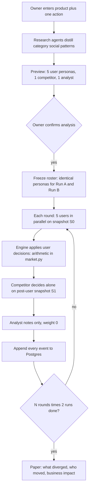
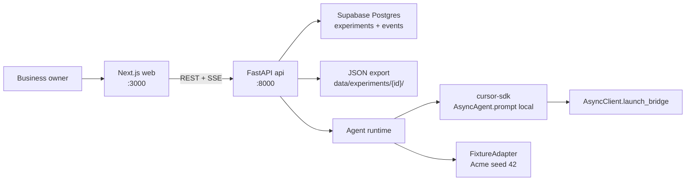
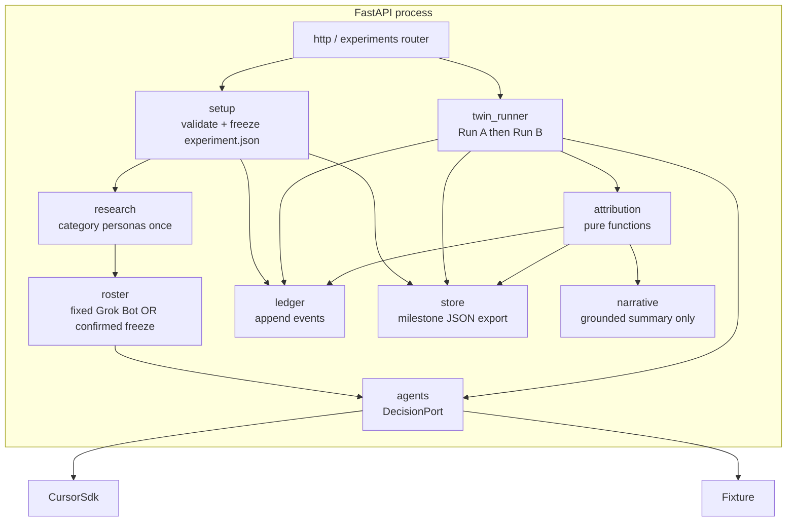
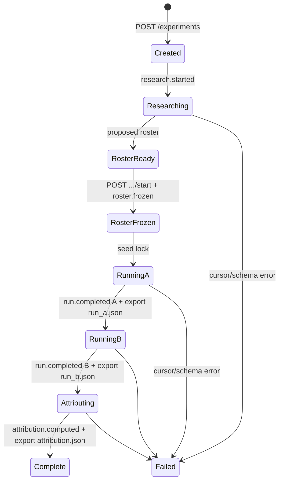
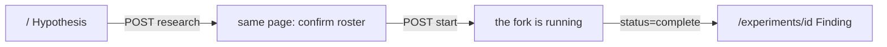
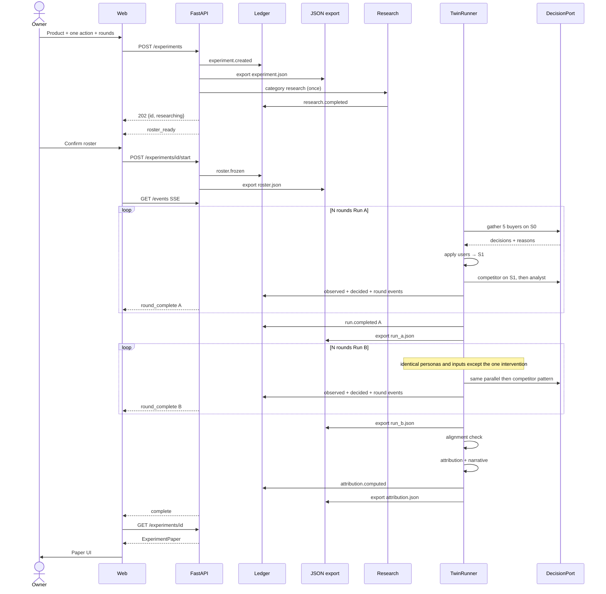

# Counterfactual Replay — System Architecture & Team Plan

**Audience:** 4 engineers, one-day hackathon  
**Companion docs:** [`counterfactual-replay-spec.md`](counterfactual-replay-spec.md) (product + causal contract), [`DESIGN-Guide.md`](DESIGN-Guide.md) (web UI system)  
**Live inference:** [Cursor Python SDK](https://cursor.com/docs/sdk/python) (`cursor-sdk`) — not a direct Grok HTTP client. Spec language about Grok 4.6 is the product metaphor; this architecture binds every live decision to `AsyncAgent.prompt`.  
**Scope:** Layer 1 twin-run engine, plus the product flow in §1.1 (research → confirm roster → twin run → paper). No calibration, no experiment grid, no Shapley.  
**Shipped:** Fixture twin-run, Grok Bot golden paper (8 rounds), sequential buyers, `POST /experiments` starts immediately. Frontend in `frontend/` per §10 as of the hackathon cut. Backend in `backend/` (not `api/` / `web/`). **Skipped:** US-A5 (one-shot roster from product text only), US-D7 (export/print). **Pending:** US-B8 (Supabase ledger) and §14 stories US-A7–A10, US-B9–B10, US-C7–C8, US-D8 (this revision).

This document is the build contract. If two tracks disagree, this file plus the spec win. Do not invent a second architecture during the day.

---

## 0. How to read this

| If you are… | Read first | Then own |
|---|---|---|
| **A — Agent Runtime** | §5, §6, ADR-3, ADR-7 | Cursor SDK adapter, prompts, personas, one-round I/O |
| **B — Twin Engine + API** | §4, §7, §7.5, §8, §9 | Twin runner, Postgres ledger, JSON exports, attribution, HTTP |
| **C — Setup & Shell** | §10, DESIGN-Guide | Tokens, app chrome, setup form, roster confirm, receipt, run progress |
| **D — Results Paper** | §10, §8, DESIGN-Guide | Metric cards, share + MRR figures, persona outcomes, competitor path, attribution, trace |
| **Everyone, first 45 min** | §1–§3, §11, §13 | Shared types, fixture, “hello world” vertical slice |

---

## 1. Goal and non-goals

### Goal

A **business owner** (the platform user) enters a product and **one** action, confirms a researched roster of **5 user personas + 1 competitor + 1 analyst**, then runs a locked-seed twin simulation. The paper shows what that one change did: two trajectories, persona outcomes, competitor path, named contributors, clickable reasons, and a visible “0 other variables changed” receipt.

There is **no business-agent persona**. The owner is outside the market; they set the intervention.

### 1.1 Product flow (this revision)



1. Owner opens `/` and fills product / business details.
2. Owner picks the one variable (live: `price_change` only) and **rounds** (3–8, default **4**).
3. `POST /experiments` starts **research**, not the twin run. Background research agents produce a proposed roster. No live social fetch during rounds.
4. UI shows the roster. Owner confirms (`POST /experiments/{id}/start`) or abandons.
5. Twin run: same frozen user personas on A and B. Users decide **in parallel**. Competitor runs **after** user decisions are applied. Analyst is meta only.
6. Engine computes share, MRR, WTP gap, prices and **hands them in** the observation JSON. Agents must not redo market math. Unchanged fields are byte-identical across A and B.
7. Every observe / decide / mutate / round event is appended to the ledger.
8. Paper: headline numbers, share **and** MRR small-multiples, persona outcomes, competitor path, attribution bar, reason console.

### Non-goals (hackathon)

- Auth, multi-user, billing (`experiments.user_id` is nullable for later)
- Redis / queues / k8s / local Docker Postgres
- Supabase Auth, Realtime, Storage, or any browser → Supabase client
- Dual-write of JSON on every agent decision
- Projection tables besides `experiments` + `events`
- Historical calibration or CSV upload
- More than one live intervention type (`price_change` only)
- Shapley / leave-one-out attribution
- Mobile-native apps

### Hard constraints (from spec)

- Roster catalogue: **5 user (buyer) personas**, **1 competitor**, **1 analyst**. No business-agent class.
- Rounds: integer **3–8**, default **4** on new experiments. Grok Bot golden paper stays **8** so the R4 demo fixture does not need a rewrite.
- 1 variable changed (`price_change` live)
- Grok Bot fixture, seed `42`, prepared in advance
- Generate-once / freeze / reuse for roster, reaction playbooks, and prompts. Research does not run between A and B.
- Live decisions via Cursor SDK (`cursor-sdk`), not a raw model HTTP client
- Reasonable token limits on every agent call (§6.9)
- UI follows `DESIGN-Guide.md` — no parallel palette; not a SaaS analytics dashboard

---

## 2. Architecture decisions

### ADR-1 — Modular monolith, two processes

**Decision:** One repo, two runtimes: Next.js (web) + FastAPI (api). Not microservices. Not a Next.js-only app.

**Why:** Four people. Backend simulation is IO-bound on Cursor agent runs and must not live inside React. Frontend can ship against a frozen OpenAPI contract. A single Next.js process would serialize the two frontend tracks onto the same app-router merge conflicts *and* block backend work on Node. The Python SDK (`cursor-sdk`) lives next to `DecisionPort` in FastAPI; do not call `@cursor/sdk` from the Next.js app.

**Trade-off:** Two `localhost` ports. Accept it. CORS allow `http://localhost:3000`.

### ADR-2 — Postgres ledger; JSON files are milestone exports

**Decision:** PostgreSQL is the live system of record: one `experiments` header row plus an append-only `events` table. The five JSON files (`experiment.json`, `roster.json`, `run_a.json`, `run_b.json`, `attribution.json`) are **milestone exports** of that ledger, not a second live store. Dual-write on every agent decision is forbidden.

**Why:** The paper still needs an inspectable bundle you can `cat`. The process also needs an ordered log of observations, decisions, market mutations, and round outcomes (~289 events per experiment). Five blobs cannot do the second job. Writing JSON after every mutation doubles I/O and splits the truth on crash. Events are the process; files are the paper.

**GET contract:** `GET /experiments/{id}` and `GET .../artifacts/{name}` read the exported JSON. If status is `complete` and a file is missing, materialize it from `events` then write the export. Do not replay events on every paper GET.

**Host:** Supabase (hosted Postgres). FastAPI uses `DATABASE_URL` (session-mode pooler URI, `sslmode=require`). Do not use the anon key, `supabase-js`, Auth, Realtime, or Storage for the ledger. The browser never talks to Supabase.

**n-user later:** `user_id text NULL` and index `(user_id, created_at desc)` now. Do not build auth (including Supabase Auth) in this layer. At scale, keep events in Supabase Postgres and move JSON bundles to object storage — table layout does not change. No extra projection tables until a query is slow.

**When not to:** Do not UPDATE or DELETE event rows. Do not add Redis, queues, k8s, or a local Docker Postgres under this ADR. If Supabase is unreachable, the experiment fails. If a JSON export fails after events are durable, set `status=failed`, `error=export_failed`; events stay.

### ADR-3 — Hexagonal agent runtime

**Decision:** Domain code never imports `cursor_sdk`. Agents talk to a `DecisionPort`. Adapters: `CursorSdkAdapter` (live) and `FixtureAdapter` (offline / tests / demo fallback).

**Why:** Cursor agent runs will flake, rate-limit, or hang. The causal pipeline and the UI must be demoable from frozen JSON. The fixture adapter is not cheating if it is labeled; a live run that cannot re-run is.

### ADR-4 — REST + SSE, not WebSockets

**Decision:** `POST /experiments` creates the experiment and starts **research** (`status=researching`). It does **not** start the twin run. `GET /experiments/{id}` returns the proposed roster when `status=roster_ready`. `POST /experiments/{id}/start` freezes that roster and starts Run A. `GET /experiments/{id}/events` is SSE for research + round progress. Paper at `status=complete`.

**Why:** The owner must see who will populate the market before spending N×2×7 agent calls. Polling is ugly; WebSockets are extra moving parts. SSE is enough for “Researching personas” then “Run B · round 3 / 4”.

**Until US-B9 lands:** the shipped API still starts the twin run on `POST /experiments` (hackathon path). Do not call that the product flow.

### ADR-5 — Shared contract package, generated once

**Decision:** Pydantic models in `backend/` are the source of truth. FastAPI emits OpenAPI. Frontend consumes generated TypeScript types (`openapi-typescript` or a checked-in `contracts.ts` if generation is too slow).

**Why:** Four people cannot verbally share JSON shapes. The first 45 minutes freeze `contracts.ts` even if codegen is not wired.

### ADR-6 — Design system is law for web

**Decision:** All UI in `frontend/` follows `DESIGN-Guide.md` and `.cursor/rules/website-design.mdc`. Tokens live in `frontend/src/styles/tokens.css`. No Tailwind default blue, no shadows, no coral CTAs.

### ADR-7 — Cursor SDK for every live decision

**Decision:** Live market agents are Cursor local agents, orchestrated from FastAPI with the **Python** SDK (`pip install cursor-sdk`). Runtime is **local**, invoked with `AsyncAgent.prompt` **once per decision**. Built-in tools are disabled (`tools=[]`) so the model can only return JSON text.

**Why these three knobs:**

1. **Python, not TypeScript.** `DecisionPort` and the twin runner already live in `backend/`. A second Node agent process would split causality across two runtimes.
2. **`AsyncAgent.prompt`, not `create` + `send`.** Durable agents keep conversation memory. Memory across rounds — or worse, across Run A and Run B — breaks the causal claim. One-shot prompt creates, runs, waits, and disposes. Isolation is the method.
3. **Local + `tools=[]`.** `cwd` is an isolated scratch directory per decision. No ambient `setting_sources`. No file edits to `run_a.json`. Live facts go to the Postgres ledger; `store.py` writes JSON exports at milestones only.

**Auth:** pass `api_key=` explicitly from settings (do not rely on ambient `CURSOR_API_KEY` in the request path). Key from [Cursor Dashboard → API Keys](https://cursor.com/dashboard/api).

**Model:** required for local. Default `composer-2.5`. Override with `CURSOR_MODEL`. At process boot, `Cursor.models.list()` and fail fast if the id is missing. Do not hardcode unlisted ids.

**Determinism honesty:** Cursor local agents do not expose Grok-style `temperature=0` + numeric seed. Identical prompts and frozen roster are still mandatory. If two fixture-free Run A’s diverge, disclose variance on the receipt and stop saying “provably caused.” FixtureAdapter remains the bit-identical path.

Docs: [Cursor Python SDK](https://cursor.com/docs/sdk/python).

### ADR-8 — Research once, confirm, then freeze

**Decision:** Social / category research runs **once** after setup, **before** the twin simulation. It emits a proposed roster. The owner confirms. Then `roster.frozen` is hashed and reused on both runs.

**Why:** Personas must react like users of that **category** on social media (public complaint vs quiet renewal vs competitor quote-tweet). That evidence belongs in a frozen **reaction playbook**, not in a live feed the agent scrolls during rounds. Live fetch during the 8 (or 4) rounds would add extra variables and void the causal claim.

**Sources (US-A8):** Reddit + web search only, and **only during the research pass**. Market-decision agents keep `tools=[]`.

**Must not:** clone a real person’s account; scrape X/TikTok/Facebook; scrape during Run A/B; invent a new decision verb per post; dump raw threads into round prompts. Map clusters onto the closed archetype catalogue. Distinctive quotes live in `traits.evidence` as **paraphrase**, max 2 short lines per buyer.

### ADR-12 — Clean research inputs (Reddit + web search)

**Decision:** Research may query Reddit and the public web, then a **filter → distill** step must run before any persona trait is written. Noisy or off-category material is dropped. If too little clean evidence remains, fall back to the fixture catalogue playbooks rather than letting junk shape behavior.

**Why:** Unfiltered Reddit and search results are memes, pile-ons, bots, and off-topic rage. That entropy would leak into `stay`/`churn`/`switch` and break the “these agents are this category” claim.

**Allow**

| Source | What to query | Keep |
|---|---|---|
| Reddit | Category subreddits inferred from the product (e.g. SaaS → `r/saas`, `r/sysadmin`; never `r/all` / meme defaults) | Posts/comments about **price, switching, competitors, renewals, feature cuts** in that category |
| Web search | `{category} pricing`, `switching from {category}`, competitor comparison, review aggregators, vendor docs | Pages that discuss the same decision types |

**Drop before distill (hard filters)**

- Outside a **18-month** recency window (configurable `RESEARCH_MAX_AGE_DAYS`, default 540)
- Reddit score `< RESEARCH_MIN_SCORE` (default **10**) or comment count `< RESEARCH_MIN_COMMENTS` (default **3**)
- Removed, NSFW, stickied, or automod-only threads
- Queries that do not include the **product category** (not only the brand name — brand-only pile-ons are too noisy)
- Items that fail a relevance gate: must mention the category **and** at least one of `{price, plan, churn, switch, competitor, renew, contract, seat}`
- Joke/meme-only, conspiracy, or slur-bearing text (blocklist)
- Duplicate URLs / near-duplicate titles
- Cap: **8 Reddit items + 8 web items** after filters (`RESEARCH_MAX_ITEMS_PER_SOURCE = 8`)

**Distill (required)**

1. Summarize kept items into category **patterns**, not named users.
2. Map each pattern onto an **existing** catalogue `archetype` (lookup `ArchetypeProfile`). Do **not** rewrite `mindset` or `behavior`.
3. Write `traits.evidence` as 1–2 paraphrases. **Raw post bodies never enter `AgentDecisionRequest`.**
4. If kept items `< RESEARCH_MIN_KEEP` (default **4**), do not invent playbooks from scraps — use `fixed_grok_bot` (or catalogue defaults) and label the roster `research_quality: "fallback"`.

**Determinism:** run research once; store the **filtered item ids/urls + distilled roster** as artifacts (`research.json` + `roster.json`). Both twin runs reuse that freeze. Do not re-query Reddit or search between A and B.

### ADR-9 — Class + archetype + instance; no business agent

**Decision:** Four layers on every roster agent:

| Layer | Closed or open | What it controls |
|---|---|---|
| `class` | Closed: `buyer` \| `competitor` \| `analyst` | Decision verbs and apply order |
| `archetype` | Closed small enum (the **label**) | Chart bands; lookup key |
| `profile` | Closed, authored in `catalogue.py` / `profiles.py` | Generalized **mindset + behavior** for that label — the same text for every experiment |
| Instance | Open | WTP, loyalty, frozen `evidence` paraphrases from research |

Buyer archetype labels: `price_sensitive`, `loyalist`, `value_seeker`, `enterprise`, `churn_risk`. Competitor: `incumbent` (default). Analyst: `meta` (does not move the market).

Each label **must** resolve to a full `ArchetypeProfile` (see §6.1.1). The label alone is not enough to prompt an agent. Research **must not** rewrite `mindset` or `behavior_*` — it only maps a person onto a label and may add `evidence`. That is how ADR-12 junk stays out of psychology.

**No `business` class.** The platform user *is* the business owner.

Do not let research invent new classes or new profiles. `role` may remain a display string (`price_sensitive_buyer`) derived from class+archetype so existing papers still load.

### ADR-10 — Parallel users, then competitor on S1

**Decision:** Each round:

1. Snapshot **S0** (prices, status, share, MRR, precomputed `wtp_gap`).
2. Five buyer agents `asyncio.gather` on identical S0.
3. Engine applies stay/churn/switch → **S1**.
4. Competitor decides **alone** on S1 (`hold` / `undercut` / `match`).
5. Analyst reads the round log; weight 0.

Same order both runs. Buyers never see each other’s in-round decisions. The competitor **does** see this round’s user reactions.

**Supersedes** the hackathon freeze “everyone observes S0.” Shipped `twin_runner.py` still uses sequential S0-for-all until US-A10.

### ADR-11 — Token limits

**Decision:** Cap every Cursor call. Social corpora never enter round prompts — only the distilled playbook.

| Call | Input budget | Output | Repairs |
|---|---|---|---|
| Research (once) | Product text + capped evidence | Roster JSON only | 1 then fail |
| Each market decision | Snapshot + frozen persona (~1k tokens) | JSON; `reason` 40–400 chars | 1 then fail experiment |

`tools=[]` on market decisions. `history_summary` stays the deterministic short string (US-A6). If `AgentOptions` exposes a max-token field, set it; otherwise enforce via prompt size + reason cap. Same model id for all market decisions.

---

## 3. System context



Trust boundary: the browser never calls Cursor or Supabase. `CURSOR_API_KEY` and `DATABASE_URL` stay on the backend. The web app only ever sees frozen artifact exports and progress events. The live log lives in Supabase Postgres.

---

## 4. Logical modules

One FastAPI process, modular internals. Modules talk only through public functions / Pydantic types — never by reaching into each other’s internals. This is a modular monolith, not four services.



| Module | Responsibility | Must not do |
|---|---|---|
| `setup` | Validate input, lock seed, append `experiment.created`, export `experiment.json` | Start the twin run; call Cursor for market decisions |
| `research` | Reddit + web search once → filter → distill → proposed 5+1+1 roster + playbooks | Run during A/B; invent new classes; dump raw threads into round prompts; use X/TikTok; skip the hygiene filters |
| `roster` | Freeze confirmed roster; append `roster.frozen` | Differ between run A and run B |
| `agents` | One decision per agent per round, schema-valid JSON, token-capped | Mutate market state; recompute share/MRR |
| `twin_runner` | Apply intervention only to B from `applies_from_round`; N rounds × 2; parallel buyers then competitor on S1; emit events | Invent attribution text |
| `market` | Share, MRR, WTP gap, prices — handed to agents in the observation | Let the model invent arithmetic |
| `attribution` | Divergence, weights, normalize to 100% | Call Cursor |
| `narrative` | 1–2 sentences citing stored reasons | Add claims not in logs |
| `ledger` | Append-only `events` + `experiments.status`; fail if Supabase is down | UPDATE/DELETE events; business logic; anon key |
| `store` | Atomic JSON export at milestones; load paper by id | Be the live log; rewrite files per decision |
| `http` | Auth-less REST + SSE (`Last-Event-ID` = `events.seq`) | Simulation internals |

Frontend modules (Next.js) are pages + design-system components, not a second domain layer. The paper view is a renderer of `ExperimentPaper`. It does not recompute causality.

---

## 5. Repository layout

```
/
├── counterfactual-replay-spec.md
├── DESIGN-Guide.md
├── architecture.md                  ← this file
├── README.md
├── backend/
│   ├── pyproject.toml               # fastapi, pydantic, cursor-sdk
│   ├── app/
│   │   ├── main.py                  # FastAPI app, CORS
│   │   ├── settings.py              # CURSOR_API_KEY, CURSOR_MODEL, DATA_DIR, DATABASE_URL
│   │   ├── contracts.py             # Pydantic source of truth
│   │   ├── http/
│   │   │   └── experiments.py       # routes + SSE
│   │   ├── setup.py
│   │   ├── roster/
│   │   │   ├── fixed_grok_bot.py    # P0 fixture
│   │   │   ├── generate.py          # US-A8 research → proposed roster
│   │   │   ├── catalogue.py         # class + archetype enums (US-A7)
│   │   │   └── research/            # Reddit + web search, filter, distill (ADR-12)
│   │   ├── agents/
│   │   │   ├── port.py              # DecisionPort
│   │   │   ├── cursor_adapter.py    # CursorSdkAdapter (AsyncAgent.prompt)
│   │   │   ├── fixture.py
│   │   │   ├── prompts.py
│   │   │   └── schemas.py           # JSON schema the prompt must return
│   │   ├── cursor_client.py         # process-level AsyncClient.launch_bridge
│   │   ├── twin_runner.py
│   │   ├── market.py                # state + metrics
│   │   ├── attribution.py
│   │   ├── narrative.py
│   │   ├── ledger.py                # append events; US-B8
│   │   └── store.py                 # milestone JSON export
│   ├── db/
│   │   └── schema.sql               # experiments + events (apply in Supabase SQL Editor)
│   └── tests/
│       ├── test_attribution.py
│       ├── test_twin_determinism.py
│       └── test_narrative_grounding.py
├── frontend/
│   ├── package.json
│   ├── src/
│   │   ├── app/
│   │   │   ├── layout.tsx
│   │   │   ├── page.tsx             # setup
│   │   │   └── experiments/[id]/page.tsx
│   │   ├── styles/tokens.css
│   │   ├── components/              # DESIGN-Guide components only
│   │   ├── lib/api.ts
│   │   └── types/contracts.ts       # frozen shared types
│   └── public/
├── supabase/
│   └── migrations/                  # same DDL for `supabase db push`
└── data/
    └── experiments/
        └── grok-bot-seed-42/        # checked-in golden paper for UI
            ├── experiment.json
            ├── roster.json
            ├── run_a.json
            ├── run_b.json
            └── attribution.json
```

**Local run:** `cd backend && DEFAULT_ADAPTER=fixture uvicorn app.main:app --port 8000` and `cd frontend && npm run dev` (port 3000). See `README.md`.

**Golden paper:** Person B (or A+B) checks in `data/experiments/grok-bot-seed-42/` as soon as a plausible twin-run exists — even from `FixtureAdapter`. Person D builds the entire dashboard against this folder and never waits on live Cursor.

---

## 6. Agent runtime (Person A)

### 6.1 Roster catalogue (users, competitor, analyst)

**Classes** (closed):

| `class` | Agent ids | Count | Observes | Decides |
|---|---|---|---|---|
| `buyer` | `buyer_{1..5}` | 5 instantiated (weights sum to `market_size`) | S0: own playbook, WTP, loyalty, **precomputed** `wtp_gap`, prices, status | `stay` / `churn` / `switch` |
| `competitor` | `competitor` | 1 | **S1** after users applied: your price, new share, churn this round | `hold` / `undercut` / `match` |
| `analyst` | `analyst` | 1 | full round history | `note` — weight 0 |

**No business class.**

**Buyer archetype labels** (closed; chart bands): `price_sensitive`, `loyalist`, `value_seeker`, `enterprise`, `churn_risk`.

Each label is a key into a frozen **`ArchetypeProfile`** (§6.1.1): mindset, social voice, what they value/ignore, and how they behave on a price hike / cheaper competitor / feature cut / status quo. Instance fields (WTP, loyalty, `evidence`) sit **on top of** that profile. They do not replace it.

Reasons must sound like that profile, not like an economist in an experiment. Decision verbs stay the closed enum — a social pile-on maps to `churn` / `switch` / `stay`, it does not create a `tweet` action.

**Market size vs instantiated callers:** 30 addressable buyers. Instantiate **5** weighted Cursor buyer agents. Do not spawn 30 live prompts.

WTP must straddle the forked price (Grok Bot: $144). At least two buyers sit in `$120–$144`. That band *is* the plot.

Fixture `fixed_grok_bot.py` maps onto this catalogue (price-sensitive vs enterprise/loyalist). Display `role` strings may stay for golden JSON compatibility.

### 6.1.1 Archetype profiles (mindset + behavior)

Closed catalogue. Same JSON for every product. Research may choose **which** profile an instance uses; it may not author a new mindset.

```python
class ArchetypeProfile(FrozenModel):
    id: str                    # matches RosterAgent.archetype
    one_liner: str             # UI table
    mindset: str               # 150–250 words: how this category thinks
    social_voice: str          # how they talk in category forums
    values: list[str]          # what they optimize
    ignores: list[str]         # what they discount
    switching_friction: Literal["low", "medium", "high"]
    publicness: Literal["loud", "quiet", "mixed"]
    behavior: dict[str, str]   # keys: price_hike, competitor_cheaper, feature_cut, status_quo
    default_playbook: dict[str, str]  # maps those keys to stay|churn|switch|hold|match|undercut
```

`prompt_block(profile)` is the exact text copied into `AgentDecisionRequest.persona["profile"]` every round (byte-identical on A and B).

**`price_sensitive`**

- **One-liner:** Leaves when price crosses what the job is worth; treats hikes as bait-and-switch.
- **Mindset:** This buyer treats the product as a line item, not an identity. They keep a running comparison of “what I pay” vs “what I actually use this month.” A price increase is not a signal of quality; it is a prompt to reopen the make-vs-buy decision. They assume vendors will keep pushing price if nobody leaves, so staying quiet feels like consent. Loyalty programs, founder stories, and “we’re investing in the platform” barely register. They will tolerate rough UX if the cheaper option is close enough on the job-to-be-done. They decide quickly, often the same week as an invoice change, and they prefer a visible alternative already sitting in another tab. They are not trying to punish the vendor; they are trying not to feel stupid for overpaying. If the hike still sits under their willingness to pay and no cheaper close substitute exists, they stay — grudgingly. The moment a competitor is obviously cheaper for the same job, they switch and will say so in public with screenshots of the two invoices.
- **Social voice:** Public, concrete, screenshot-heavy. Talks in dollars, seats, and “not worth it anymore.” Compares two tabs. Rarely writes long strategy posts.
- **Values:** Low total cost, an easy out, a visible cheaper alternative.
- **Ignores:** Roadmap promises, brand prestige, “we’re investing in the platform.”
- **Friction / publicness:** low / loud
- **Behavior:** `price_hike` → churn or switch if over WTP; `competitor_cheaper` → switch if the gap is obvious; `feature_cut` → churn threat in public; `status_quo` → stay while price ≤ WTP.
- **Playbook:** `price_hike: switch_if_above_wtp`, `competitor_cheaper: amplify_and_switch`, `feature_cut: public_churn_threat`, `status_quo: stay`.

**`loyalist`**

- **One-liner:** Stays through a hike if the product still does the job they already trust.
- **Mindset:** Switching cost is mostly emotional and operational: workflows, muscle memory, “we already trained the team.” They interpret a price increase as inflation or a premium they might owe if the product has been reliable. They want to believe the vendor. They will wait a round or two before acting, looking for a reason to stay — a roadmap note, a feature they still use daily, a support person who remembers them. They dislike public pile-ons and will sometimes defend the product in comments even when they privately wince at the new price. They churn only after a broken promise (outage, removed feature they depend on) or a hike that feels extractive relative to their willingness to pay. Small competitor discounts do not move them; re-training does. They are the segment that makes “share down, MRR up” possible, because they keep paying while price-sensitive neighbors leave. Give them continuity and they stay; surprise them with extraction and the patience runs out.
- **Social voice:** Defensive or quiet. “They’ve earned this.” Short, less numeric than price-sensitive buyers.
- **Values:** Continuity, trust, not re-training.
- **Ignores:** Small competitor discounts, launch-week outrage threads.
- **Friction / publicness:** high / quiet
- **Behavior:** `price_hike` → stay unless far above WTP; `competitor_cheaper` → stay; `feature_cut` → stay and wait; `status_quo` → stay.
- **Playbook:** `price_hike: stay_unless_far_over_wtp`, `competitor_cheaper: ignore`, `feature_cut: give_a_chance`, `status_quo: stay`.

**`value_seeker`**

- **One-liner:** Re-shops every round: yours vs competitor on price *and* what they get.
- **Mindset:** Neither cheap nor loyal by default. They keep a mental scorecard: features they actually use, list price, competitor price, and “am I still getting a fair deal.” A hike is acceptable if the product pulled ahead on the jobs they care about; it is not acceptable if the competitor now looks equivalent and cheaper. They will switch without drama if the scorecard flips — no manifesto, no screenshot pile-on, just a cancelled seat. They read comparison posts and review sites more than meme threads. They re-score every round, including feature cuts, because a missing capability can flip the deal even when price did not move. They are the swing voters of the market and the plot of many forks: if the paper’s share move is unexplained by the two extremes (price-sensitive vs enterprise), it is usually this segment. They ignore pure brand love and also ignore “cheapest at any quality.”
- **Social voice:** Comparative, list-like. “X does Y, Z is $N less.” Asks “is it still worth it?”
- **Values:** Fairness of deal, feature-for-dollar, optionality.
- **Ignores:** Pure brand love, pure lowest-price-at-any-quality.
- **Friction / publicness:** medium / mixed
- **Behavior:** `price_hike` → stay if still better deal, else switch; `competitor_cheaper` → switch if quality is close; `feature_cut` → re-score and often switch; `status_quo` → stay.
- **Playbook:** `price_hike: rescore_then_stay_or_switch`, `competitor_cheaper: switch_if_close`, `feature_cut: rescore`, `status_quo: stay`.

**`enterprise`**

- **One-liner:** High WTP, slow clock; procurement and switching cost dominate tweets.
- **Mindset:** The buyer is not the person posting on Reddit. Decisions wait on contract cycles, security review, and the cost of migrating seats. A 20% hike that still sits under budget is a paperwork event, not a churn event. They notice competitor price but cannot switch in one round even when the gap is real. They will stay through the simulation horizon unless the hike plus a broken dependency (SSO, uptime, a compliance checkbox) makes renewal indefensible to finance. They care about vendor stability and “can I defend this in a QBR,” not about looking savvy in a comment section. Same-week outrage threads do not enter the packet. If they talk at all it is in private communities: “has anyone’s legal team reviewed the new terms.” They may flag a cheaper rival for next year’s bake-off and still stay this year. Treat a one-round competitor discount as noise; treat a broken dependency as a crisis.
- **Social voice:** Quiet. If they talk at all it is in private communities or “has anyone’s legal team reviewed…” — not screenshots of invoices.
- **Values:** Reliability, switching cost, budget line already approved.
- **Ignores:** Same-week social outrage, small absolute dollar gaps.
- **Friction / publicness:** high / quiet
- **Behavior:** `price_hike` → stay this horizon if under WTP; `competitor_cheaper` → stay (note for later); `feature_cut` → stay, escalate internally; `status_quo` → stay.
- **Playbook:** `price_hike: stay_if_under_wtp`, `competitor_cheaper: stay`, `feature_cut: stay_escalate`, `status_quo: stay`.

**`churn_risk`**

- **One-liner:** Already unhappy; a small shock is enough to leave.
- **Mindset:** They are still subscribed, but the relationship is thin: missed expectations, support pain, or a feature they needed and did not get. They have one foot out. A price hike is the excuse they were waiting for, not a new analysis. Competitor marketing lands because it matches a story they already tell themselves. They over-weight negative anecdotes. They decide fast. They are loud after they leave, not before — the public post is a verdict, not a negotiation. Do not confuse them with price-sensitive buyers: they may have high willingness to pay and still churn because trust is gone. Roadmap slides and “we’re sorry for the inconvenience” do not buy a round. Status quo keeps them only while nothing else shocks the account; any hike, cut, or cheaper close substitute ends it. If the product merely fails to delight, they still stay this round; if it confirms the grievance, they leave.
- **Social voice:** Frustrated, specific grievances. “Been saying this for months.”
- **Values:** Being heard, an exit that feels justified.
- **Ignores:** Roadmap slides, “we’re sorry for the inconvenience.”
- **Friction / publicness:** low / loud (after the decision)
- **Behavior:** `price_hike` → churn; `competitor_cheaper` → switch; `feature_cut` → churn; `status_quo` → stay but fragile (high chance of churn on any shock).
- **Playbook:** `price_hike: churn`, `competitor_cheaper: switch`, `feature_cut: churn`, `status_quo: stay_fragile`.

**`incumbent` (competitor)**

- **One-liner:** Defends share; matches when the fork is stealing customers, holds when it is not.
- **Mindset:** They are the other vendor in this market, not a commentator. After users move, they look at two facts: what you now charge and whether your share fell this round. Matching is a weapon, not a brand promise — they match when the fork is peeling off customers they can still serve at their current price. They undercut only if they can remain the cheaper tab after your hike; racing to zero trains buyers to wait for a discount. They will hold when share is stable even if you raised price, because panic matching advertises weakness. They do not copy your feature story or your launch narrative. They assume a slice of your roster was always one invoice away from switching. They never invent a fourth verb: hold, match, or undercut. They do not exist to advise the owner. Their clock is this round’s post-user snapshot, not your apology thread.
- **Social voice:** Short, commercial, unsentimental. Speaks in share points and list price, not in community outrage. Will not write a thought-leadership post about your hike.
- **Values:** Defendable share, looking cheaper when it matters, not training the market to expect a discount.
- **Ignores:** Your roadmap, your apology thread, analyst advice to the owner.
- **Friction / publicness:** medium / quiet (moves show up as price, not tweets)
- **Behavior:** `your_price_up` → match or undercut if share slipped this round; `share_stable` → hold; never invent a new verb.
- **Playbook:** `share_drop: match`, `share_stable: hold`, `you_still_cheaper: hold`.

**`meta` (analyst)**

- **One-liner:** Notes only. Weight 0. Reports what differed; does not move the market.
- **Mindset:** They sit outside the market. Weight is always zero: a note cannot change share or MRR. Their job is to report what differed between the two worlds this round — who stayed, who left, whether the competitor matched — in the voice of a careful observer, not a consultant. They do not tell the owner to raise price, cut a feature, or “lean into loyalists.” They do not take a buyer verb or a competitor verb. If nothing diverged they say that plainly. They cite archetype labels and decisions, not vibes. They refuse to launder social-media junk into a recommendation. Their audience is the paper’s reason console, not the market. They would rather under-claim (“share moved because buyer_2 switched”) than invent a story the log does not support. A good note names who moved, on which run, after which price. They never propose an intervention of their own, even when asked.
- **Social voice:** Neutral, specific, past-tense. “Buyer_2 switched on B after the hike; competitor held.” No slogans.
- **Values:** Fidelity to the log, named contributors, a readable contrast of A vs B.
- **Ignores:** Advice-shaped conclusions, new market verbs, raw Reddit.
- **Friction / publicness:** high / quiet
- **Behavior:** every stimulus → `note` only.
- **Playbook:** `price_hike: note`, `competitor_cheaper: note`, `feature_cut: note`, `status_quo: note`.

Attach `profile_for(archetype)` in the twin runner when building `AgentDecisionRequest.persona`. Do not ask the model to remember the profile from a previous round (one-shot prompt).

### 6.2 DecisionPort

```python
class DecisionPort(Protocol):
    async def decide(self, request: AgentDecisionRequest) -> AgentDecision:
        """Isolated one-shot. Reject empty/generic reasons."""
```

`AgentDecisionRequest` is the spec §5.2 JSON plus `run_id: "A" | "B"` and `agent_id`. Non-intervention fields for a given `(agent_id, round)` must be **byte-identical** across A and B until `applies_from_round`. The twin runner is responsible for that. The adapter must not add extra entropy (no conversation memory, no extra prompt wrapping).

Port is **async**. FastAPI and `cursor-sdk` async surfaces stay on one event loop. Do not call sync `Agent.prompt` from a thread pool “to make it work” — mix of sync/async clients is forbidden.

### 6.3 Process-level Cursor client

One `AsyncClient` per API process, created at startup, closed at shutdown. There is no global async default client.

```python
# app/cursor_client.py
from cursor_sdk import AsyncClient

async def lifespan(app):
    async with await AsyncClient.launch_bridge(workspace=settings.DATA_DIR) as client:
        app.state.cursor = client
        yield
```

Use `await client.agents.create(...)` or `await AsyncAgent.prompt(..., client=client)`. Pass `client=` on every prompt. Never mix this client with sync `Agent` / `CursorClient` in the same path.

Log `agent.agent_id` and `run.id` immediately after `send` / as soon as `prompt` returns, before parsing JSON. If a run hangs, those IDs are what you inspect via `Agent.get_run`.

### 6.4 CursorSdkAdapter

Invocation pattern: **`AsyncAgent.prompt` (one-shot)**. Not durable `create` + `send`. Each decision is a new agent so Run A cannot leak into Run B and round N cannot leak into round N+1.

```python
from cursor_sdk import (
    AgentOptions,
    AsyncAgent,
    CursorAgentError,
    LocalAgentOptions,
)

async def decide(self, request: AgentDecisionRequest) -> AgentDecision:
    scratch = experiment_scratch(request)  # data/experiments/{id}/scratch/{run}/{round}/{agent_id}
    scratch.mkdir(parents=True, exist_ok=True)
    prompt = render_decision_prompt(request)  # identical template A vs B; only JSON payload differs
    try:
        result = await AsyncAgent.prompt(
            prompt,
            AgentOptions(
                api_key=settings.CURSOR_API_KEY,  # explicit, not ambient
                model=settings.CURSOR_MODEL,      # default composer-2.5
                name=f"{request.experiment_id}:{request.run_id}:r{request.round}:{request.agent_id}",
                tools=[],                         # text only — cannot edit artifacts
                local=LocalAgentOptions(cwd=str(scratch)),  # explicit local; do not omit
                # setting_sources omitted on purpose: inline config only
            ),
            client=self.client,
        )
    except CursorAgentError as err:
        # Run never started (auth, config, network). Retry only if err.is_retryable.
        # Honor err.retry_after if present.
        raise DecisionStartupError(err) from err

    if result.status == "error":
        # Run started and failed. Do not retry blindly (duplicate agents).
        raise DecisionRunError(result.id)

    decision = parse_and_validate_json(result.result)  # decision, reason, confidence
    return decision
```

| Setting | Value |
|---|---|
| Package | `cursor-sdk` (Python). Docs: https://cursor.com/docs/sdk/python |
| Runtime | **Local**, always pass `local=LocalAgentOptions(cwd=...)` |
| Pattern | `AsyncAgent.prompt` — create, one prompt, wait, dispose |
| Model | `composer-2.5` unless `CURSOR_MODEL` override; validate with `Cursor.models.list()` at boot |
| Tools | `tools=[]` — no shell, no edit, no MCP; JSON in `result.result` |
| Settings | Do **not** set `setting_sources` (no project/user/team leak into the market agent) |
| Auth | `api_key=settings.CURSOR_API_KEY` on every call |
| Isolation cwd | `data/experiments/{id}/scratch/{run_id}/r{round}/{agent_id}/` empty except optional `request.json` copy for debug |
| Prompt hash | SHA-256 of the **template** (not the per-agent JSON); stored on `experiment.json` |
| Retry | Startup: only if `err.is_retryable`, honor `retry_after`. Run failure: no retry unless we mint a new idempotent decision with the same prompt (still a new agent). Max 1 repair prompt if JSON invalid / reason denylisted, then fail the experiment |

Parse `result.result` as JSON. Strip a wrapping markdown fence if present. Reject `reason` empty, shorter than 40 chars, or denylist (`"I decided to churn"`, `"Because of the price"`). One repair `AsyncAgent.prompt` with the schema echoed; if still bad, fail loudly. Do not silently substitute.

**Do not** use `Agent.create` + multi-turn `send` for market decisions. Follow-ups keep conversation context; that is contamination.

**Do not** use cloud agents for the twin-run (`cloud=CloudAgentOptions(...)`). Cloud clones a repo and is the wrong isolation model. Local against scratch cwd is the experiment.

### 6.5 FixtureAdapter

Returns canned, specific reasons keyed by `(agent_id, round, run_id)` for the Acme fixture. Used for:

- Unit tests
- UI development before Cursor is stable
- Demo fallback if the SDK/bridge dies mid-pitch (label the receipt: `adapter: fixture`)

If the fixture adapter is used, the receipt **must** say so. Never claim Cursor SDK on fixture data.

### 6.6 Prompt rules

- Decision prompt **template** is identical for A and B. Only the request JSON body may differ, and only by the intervention field after `applies_from_round`.
- Address the agent as this customer / competitor, not as “you are `buyer_3` in an experiment.”
- `persona` must include the frozen `profile` (mindset + behavior) for that archetype plus instance WTP/evidence. The model follows the profile; evidence may color the reason, not invert the playbook.
- User payload is JSON only (no extra prose that could drift between runs). Include **precomputed** market fields (`wtp_gap`, share, mrr on competitor S1). Agents must not recalculate them.
- Instruct: reply with a single JSON object, no markdown, keys `decision`, `reason`, `confidence`. `reason` 40–400 characters, category voice, cite the product decision just observed, stay consistent with the frozen playbook.
- `history_summary` is a deterministic string built from prior *decisions*, not a second Cursor agent summarize step.
- Analyst: simpler path — runs inside each run on that run’s history; attribution uses decision-diffs of buyers/competitor only. Analyst weight 0.

### 6.7 Failure modes (Cursor-specific)

| Failure | How you tell | What to do |
|---|---|---|
| `CursorAgentError` | Exception, `is_retryable` | Auth/config/network. Fix env. Retry only if retryable. Exit path = experiment `failed` |
| `result.status == "error"` | Returned RunResult | Run executed and failed. Log `result.id`. Do not treat as startup. |
| Silent local agent | Forgot `local=` | SDK defaults to local anyway — still **pass `local=` explicitly** so we never accidentally want cloud and get local |
| Resource leak | Skipped dispose | `AsyncAgent.prompt` disposes for you. If you switch to `create`, you must `async with` |
| Context leak | `create` + `send` follow-up | Forbidden for twin-run decisions |
| Ambient settings | `setting_sources="all"` | Forbidden. Market agents must not load this repo’s Cursor rules |

### 6.8 Research agents (once per experiment)

Given `product_name`, `product_description`, `current_price`, `competitor_price`, `market_size`, emit a proposed `Roster` with:

- exactly 5 `buyer` instances covering at least 3 archetypes, weights summing to `market_size`
- 1 `competitor`
- 1 `analyst`
- per-buyer `reaction_playbook` + short `evidence` (paraphrase, not a thread dump)

**Pipeline (ADR-12):** (1) infer category + allowlisted subreddits + search queries from the product text; (2) fetch Reddit + web search; (3) apply hard filters (recency, score, relevance, blocklist, caps); (4) distill survivors into catalogue playbooks; (5) if too few survivors, fixture fallback with `research_quality: "fallback"`.

Do **not** fetch Reddit or the web during the twin run. Research agents may use tools **only in this pass**. Market `DecisionPort` stays `tools=[]`. Fixture path: skip fetch, use `fixed_grok_bot.py`, still show a confirm step with that roster.

Map every invented cluster onto the catalogue. Reject a roster that adds a fourth class or a new decision verb. Raw Reddit/HTML must not appear in `AgentDecisionRequest.persona`.

### 6.9 Token limits

See ADR-11. Settings (names illustrative): `MAX_DECISION_INPUT_TOKENS`, `MAX_REASON_CHARS=400`, `MAX_REPAIR_PROMPTS=1`. Research hygiene: `RESEARCH_MAX_AGE_DAYS=540`, `RESEARCH_MIN_SCORE=10`, `RESEARCH_MIN_COMMENTS=3`, `RESEARCH_MAX_ITEMS_PER_SOURCE=8`, `RESEARCH_MIN_KEEP=4`. Truncate `history_summary` if it would blow the input cap (keep most recent rounds first). Research output is roster JSON + a filtered `research.json` (ids/urls, not bodies).

---

## 7. Twin runner & market state (Person B)

### 7.1 State machine



Statuses: `created` | `researching` | `roster_ready` | `running_a` | `running_b` | `attributing` | `complete` | `failed`.

Invariant: `run_a` and `run_b` share `roster_hash`, `prompt_hash`, `random_seed`. The only allowed diff in inputs is the intervention field from `applies_from_round` onward. User personas are identical on both runs.

Until US-B9: shipped code jumps Created → RosterFrozen → RunningA.

### 7.2 Round loop (each run)

For `round` in `1..experiment.rounds` (3–8):

1. Build **S0**: `current_price`, `competitor_price`, subscribed set, share, MRR, per-buyer `wtp_gap`. Arithmetic lives here, not in the model.
2. If this is run B and `round >= applies_from_round`, apply `variable_delta` to the intervened field (`current_price` for `price_change`) **before** S0.
3. Call `DecisionPort.decide` for all **five buyers in parallel** (`asyncio.gather`) with identical S0. Non-intervened keys for `(agent_id, round)` must match the sibling run.
4. Apply buyer decisions (churn/switch remove weight) → **S1**.
5. Competitor decides **alone** on S1. Then analyst on the round log.
6. Append `RoundLog`. Emit SSE `round_complete`.
7. Append ledger events (`round.opened` … `round.closed`). Do **not** rewrite JSON per decision.
8. After the run finishes, export `run_a.json` or `run_b.json` once.

Crash recovery: replay `events` for that `experiment_id` ordered by `seq`. JSON files may be absent until the next milestone.

Shipped runner still loops agents sequentially on S0 (including competitor) until US-A10.

### 7.3 Metrics (pure, from state)

```
market_share = subscribed_buyer_weight / total_buyer_weight
mrr          = subscribed_buyer_weight * current_price
churn_rate   = churned_weight_this_round / subscribed_weight_last_round
wtp_gap(i)   = current_price - buyer_i.willingness_to_pay
```

Do not maintain a separate finance module. Cards read these series.

### 7.4 Alignment check (must pass before attribution)

- Rounds `1 .. applies_from_round-1`: trajectories A and B equal (floats compared at 1e-9, decisions equal).
- If this fails, **do not attribute**. Status = `failed`, error = `alignment_broken`. The causal claim is void.

For Acme, `applies_from_round = 1`, so alignment is “identical initial state only.” Still assert identical roster and opening snapshot.

### 7.5 Experiment ledger (Supabase Postgres)

Source of truth for process. JSON under `data/experiments/{id}/` is a derived paper bundle. Canonical DDL: [`backend/db/schema.sql`](backend/db/schema.sql) (idempotent enums, RLS on, `anon`/`authenticated` revoked). Apply once in the Supabase SQL Editor, or `supabase db push` using [`supabase/migrations/`](supabase/migrations/).

FastAPI connects with `DATABASE_URL` from **Project Settings → Database → Connection string → Session pooler** (port 5432), add `sslmode=require`. Do not use the Transaction pooler (6543) for this long-lived API process. Do not put `SUPABASE_ANON_KEY` or `SUPABASE_SERVICE_ROLE_KEY` in the Next.js app.

**Write protocol**

1. `INSERT` into `events` with the next `seq` for that experiment (transaction with `experiments.status` when the state machine moves).
2. Export JSON **only** at milestones: experiment + roster at freeze; `run_a` after Run A; `run_b` after Run B; `attribution` when complete.
3. If Supabase is unreachable → experiment `failed`.
4. If JSON export fails after events are durable → `status=failed`, `error=export_failed`. Never delete events.
5. SSE `id:` field = `events.seq` so reconnect does not duplicate facts.

**`experiments` (header — listing and status, no replay)**

| Column | Type | Notes |
|---|---|---|
| `id` | `text` PK | e.g. `exp_…` |
| `user_id` | `text` NULL | unused until auth; index `(user_id, created_at desc)` |
| `status` | enum | same as `Status` in contracts |
| `error` | `text` NULL | `alignment_broken`, `export_failed`, … |
| setup fields | native types | product, prices, seed, delta, adapter, rounds, hashes |
| `prompt_hash` | `text` | receipt |
| `roster_hash` | `text` | receipt |
| `created_at`, `updated_at` | `timestamptz` | |

**`events` (append-only)**

| Column | Type | Notes |
|---|---|---|
| `id` | `bigserial` | global |
| `experiment_id` | `text` FK | `ON DELETE CASCADE` |
| `seq` | `int` | unique per experiment, starts at 1 |
| `event_type` | enum | see below |
| `run_id` | `A` / `B` / NULL | experiment-level events are NULL |
| `round` | `int` NULL | |
| `agent_id` | `text` NULL | |
| `payload` | `jsonb` NOT NULL | the fact; never an empty `{}` for decide/observe |
| `occurred_at` | `timestamptz` | default `now()` |

Constraints: `UNIQUE (experiment_id, seq)`, `seq > 0`. **No UPDATE/DELETE** of event rows from application code.

**Event types** (keep `agent.observed` and `agent.decided` as two rows)

| `event_type` | When | Payload (minimum) |
|---|---|---|
| `experiment.created` | POST accepted | setup request |
| `research.started` | research agents begin | product fields |
| `research.completed` | proposed roster ready | roster draft, `research_quality`, kept-source counts (not raw posts) |
| `roster.frozen` | owner confirmed; hash locked | `roster` + `roster_hash` |
| `run.started` | before round 1 of A or B | `run_id`, opening snapshot |
| `round.opened` | S0 | prices, subscribed, share, mrr, wtp_gaps |
| `intervention.applied` | B only, `round >= applies_from_round` | field, from, to |
| `agent.observed` | exact JSON the persona saw | `AgentDecisionRequest` |
| `agent.decided` | after validate | `decision`, `reason`, `confidence` |
| `market.mutated` | after buyers applied, then after competitor | subscribed, competitor_price, snapshot id `S0`/`S1` |
| `round.closed` | end of round | share, mrr, prices |
| `run.completed` | after last round | `run_id` |
| `alignment.checked` | before attribution | `ok` or error |
| `attribution.computed` | after diffs | `divergence_by_round`, method |
| `experiment.completed` | paper ready | |
| `experiment.failed` | any hard fail | `error` |

Event count scales with `rounds` (≈ 7 agents × 2 observe/decide × N × 2 runs, plus round/run wrappers). Do not add projection tables until a query is slow. Do not duplicate this DDL in other files except `supabase/migrations/` (keep in sync with `backend/db/schema.sql`). Add `researching` / `roster_ready` to `experiment_status` when US-B9 lands.

---

## 8. Attribution & narrative (Person B)

### 8.1 Divergence

```
divergence(r) = share_A(r) - share_B(r)
```

Also store `mrr_A`, `mrr_B` for the **two** trajectory figures (share and MRR, not a toggle). Headline both.

### 8.2 Decision-diff contribution

For each round where `|Δdivergence| > threshold` (use `0.005` share, i.e. 0.5pp):

```
raw_i = 1{decision_A != decision_B} × weight_i
contribution_pct_i = 100 * raw_i / sum(raw)
```

Buyer weight = band weight / market size (or `/ total_buyer_weight`). Competitor weight = fixed `0.25` of that round’s raw mass **or** treat competitor as weight equal to 1 buyer-band; pick one, document in `attribution.json.method = "decision_diff_v1"`. Analyst weight = 0.

Normalize to 100%. If no agent differed but metrics did (should not happen), flag `unattributed` rather than inventing a cause.

### 8.3 Narrative

Input: top contributors’ `reason` strings + final share/MRR deltas.  
Output: 1–2 sentences.  
Rule: every clause must map to an `(agent_id, round, run_id)` citation array stored next to the text. If the model adds an uncitable clause, drop the sentence and use a template:

> Raising price {delta} changed share by {share_delta} and MRR by {mrr_delta}, driven by {agent_id} at round {r}: “{reason}”.

Prefer the template if time is short. A true template beats a hallucinated paragraph.

---

## 9. HTTP API (Person B)

Base: `http://localhost:8000`

| Method | Path | Body / query | Response |
|---|---|---|---|
| `POST` | `/experiments` | `CreateExperimentRequest` | `{ id, status: "researching" }` 202 |
| `GET` | `/experiments/{id}` | | proposed roster when `roster_ready`; `ExperimentPaper` when `complete`; 202 if still working |
| `POST` | `/experiments/{id}/start` | empty | `{ id, status: "running_a" }` 202 — freeze roster, start twin |
| `GET` | `/experiments/{id}/events` | SSE | `status`, `research_complete`, `round_complete`, `complete`, `failed` |
| `GET` | `/experiments/{id}/artifacts/{name}` | `experiment` \| `roster` \| `run_a` \| `run_b` \| `attribution` | raw JSON |
| `GET` | `/health` | | `{ ok, cursor_configured, model, adapter }` |

Until US-B9, `POST /experiments` still returns `running_a` and starts the twin run immediately.

### 9.1 CreateExperimentRequest

```json
{
  "product_name": "Grok Bot",
  "product_description": "Always-on AI teammates with their own cloud computer. They sign into your tools, finish jobs end to end, and only come back for approval.",
  "current_price": 120,
  "market_size": 30,
  "competitor_count": 1,
  "competitor_price": 100,
  "buyer_price_sensitivity": "medium",
  "rounds": 4,
  "random_seed": 42,
  "variable_type": "price_change",
  "variable_delta": "+20%",
  "applies_from_round": 1,
  "adapter": "cursor"
}
```

Accept `rounds` in **3–8** inclusive; default **4** if omitted. Reject `rounds` outside that range. Reject `applies_from_round` not in `1..rounds`. Reject unknown `variable_type` except `price_change`. `adapter` is `"cursor"` | `"fixture"` (fixture is for UI and fallback).

Grok Bot golden paper keeps `"rounds": 8`.

### 9.2 ExperimentPaper (GET)

```json
{
  "id": "exp_...",
  "status": "complete",
  "experiment": { },
  "roster": { },
  "receipt": {
    "random_seed": 42,
    "prompt_hash": "sha256:...",
    "roster_hash": "sha256:...",
    "other_variables_changed": 0,
    "adapter": "cursor",
    "runtime": "local",
    "model": "composer-2.5",
    "tools": []
  },
  "metrics": {
    "share_a": [80, 80, 79, 78, 77, 76, 76, 76],
    "share_b": [80, 78, 74, 69, 67, 66, 66, 66],
    "mrr_a": [1176, 1176, 1161, 1147, 1132, 1117, 1117, 1117],
    "mrr_b": [1416, 1381, 1310, 1221, 1186, 1168, 1168, 1168],
    "final_share_delta_pp": -10,
    "final_mrr_delta": 51,
    "final_churn_count_b": 4
  },
  "divergence_by_round": [ ],
  "summary_narrative": {
    "text": "...",
    "citations": [{ "agent_id": "buyer_3", "round": 4, "run_id": "B" }]
  },
  "logs": {
    "run_a": [ ],
    "run_b": [ ]
  }
}
```

Frontend never assembles this from five fetches if it can avoid it. One paper payload for the results page. Artifact endpoints exist for debugging and the pitch (“this is the record”).

### 9.3 SSE events

```
event: round_complete
data: {"run_id":"B","round":4,"share":69,"mrr":1221}

event: complete
data: {"id":"exp_..."}

event: failed
data: {"error":"alignment_broken"}
```

---

## 10. Frontend — intuitive UI plan (Persons C and D)

**Status: implemented.** The Next.js app is `frontend/`. Two routes. No auth. No dashboard chrome.

Two routes. No auth. No dashboard chrome. The UI is a short paper a stranger can read.



### 10.0 What “intuitive” means here

A judge who has never read the spec should, without help:

| Time | They understand |
|---|---|
| 5s | This is an experiment, not a forecast. |
| 20s | We will change **one** price and hold everything else. |
| 60s | Share went down, money went up. |
| 90s | Round 4 is where it split; these two agents caused it; here is why in their own words. |

If they have to hunt a sidebar, decode a form, or click a tiny chart dot to find the story, the UI has failed.

**Do not build:** a SaaS analytics dashboard, a chat with agents, a settings page with 12 fields, a spinner as the only waiting UI, or a chart that is the only way to select a round.

**Do build:** a hypothesis you can read in one sentence, a roster the owner confirms, a finding you can read in one sentence, round pills R1–RN, two trajectory figures, and a dark side-by-side console that opens on the round that actually moved.

### 10.1 Four screens, one story

#### Screen 1 — Hypothesis (`/`)

The page is not “configure simulation.” It is “write the fork.”

**Layout (desktop, 12-col feel, lots of white):**

```
[ black announcement: Controlled experiment — not a forecast ]
[ Replay          Counterfactual          Open Grok Bot paper ]

Change one thing.
See who caused the rest.

  You are testing          │  Product
  Raise Grok Bot           │  name, one-line description
  from $120 to $144        │  current price · competitor price
  starting round 1.        │
                           │  The one change
                           │  type: price  delta: +20%  from round 1
  [ Begin research ]       │
  Open the prepared paper  │  Method
                           │  rounds 4 (3–8) · seed 42 · 0 other variables
```

**Intuition rules:**

1. **Plain-English preview, live.** Left column restates the form as one sentence. If they change price or delta, the sentence updates. That sentence is the product, not the inputs.
2. **Grok Bot is already filled.** First-run cost is one click, not a form. Empty fields are a failure.
3. **Two doors, labeled honestly.**
   - Primary pill: `Begin research` → `POST /experiments` (research, then confirm). Until US-B9: still `Run this experiment` and starts the twin immediately.
   - Secondary underline: `Open the prepared Grok Bot paper` → `/experiments/grok-bot-seed-42` from golden JSON. This is the demo path. Never dress fixture as live Cursor.
4. **Method is a receipt plus one owner control.** **Rounds** is tunable (3–8, default 4) on the Method strip. Seed and “0 other variables” stay locked. Rounds is not the intervened variable; both runs use the same N.
5. **Fields grouped as Product / The one change / Method.** Do not present spec §4 as a flat 11-row spreadsheet.
6. **Only `price_change` is choosable.** Other enum values stay out of the control. One beautiful fork beats a dropdown of unfinished interventions.

**Mobile:** sentence on top, form below, CTAs sticky at the bottom.

#### Screen 2 — Confirm roster (same `/`, after research)

The owner sees who will populate the market **before** paying for N×2 decision calls.

```
Five users we inferred          Competitor
price_sensitive · WTP $128      incumbent · $100
loyalist · WTP $168             Analyst (notes only)
…

[ Confirm and run analysis ]
```

- Fixture path still shows this screen, with the frozen Grok Bot roster, so the flow is one story.
- Primary: `Confirm and run analysis` → `POST /experiments/{id}/start`.
- Secondary: abandon / edit product (new POST; do not mutate a frozen roster).

#### Screen 3 — The fork is running (same `/`, swapped body)

No route change. The headline becomes the live method: `Running · $120 vs $144`.

```
Run A  baseline $120    Run B  +20% → $144
R1 ···                  R1 ···
R2 ···                  R2 ·
                        (fills only from SSE)

Now: Run B · round 3 of 4
share 69%   MRR $1,221
```

**Intuition rules:**

- Two columns, A then B. People should see “same world, then the fork.”
- Round ticks come from SSE `round_complete`, never from `setInterval`.
- If the API is missing, do **not** fake ticks. Show: `API is not running. Open the prepared Grok Bot paper.` plus the secondary link.
- Failed runs stay here with the engine error. Never navigate to a paper of invented numbers.

#### Screen 4 — Finding (`/experiments/[id]`)

Read top to bottom in **demo-script order**. Default state must already show the interesting round. Do not land on a blank chart and hope they click.

```
[ announcement ]

Baseline $120 vs +20% → $144

Raising Grok Bot 20% costs 10 points of share and still
adds $115 MRR, because the buyers who left sat at WTP $128–$140.
buyer_3 · R4 · B

Share  −10pp     MRR  +$51     Left  4
fell             rose          buyers

Figure 1 · Share %     Figure 2 · MRR $     [R1 … RN]
two lines, marker at intervention          selected round

Persona outcomes (A vs B stay/churn/switch)
Competitor path (price + hold/match/undercut)

This round: 62% price-sensitive churn · 38% competitor matching
[ stacked bar for selected round ]

┌ agent-console-card ──────────────────────────────────────┐
│ Round 4 · only decisions that differed                   │
│ buyer_3     A stay    “WTP $55, price $49…”              │
│             B churn   “Price $7 above my WTP of $52…”    │
│ competitor  A hold    “Share stable…”                    │
│             B match   “Share dropping, matching $59.”    │
└──────────────────────────────────────────────────────────┘

Receipt: seed 42 · local · composer-2.5 · 0 other variables changed
Causality is inside this frozen market, not a forecast of the real one.
```

**Intuition rules:**

1. **Tension is the hero, not the chart.** Three numbers with verbs (`fell` / `rose` / `left`). Share down and MRR up must be visually opposite (danger vs success) so the paradox is obvious.
2. **Round pills are the selector.** `R1`…`RN` under the figures, large enough to tap. Chart points also select, but pills are the obvious control. Never require hovering a 4px dot. N comes from `experiment.rounds`.
3. **Land on the plot round.** On load, select the first round where `|share_a − share_b|` jumps (Grok Bot 8-round fixture: **R4**). Trace and attribution bind to that round immediately.
4. **Four figures, not a dashboard.** (1) share trajectories A vs B, (2) MRR trajectories A vs B — **two small-multiples, not a Share/MRR toggle**. (3) persona outcomes: each of the five users stay/churn/switch in A vs B; optional WTP dots with the price line. (4) competitor price/decision path A vs B. Then the existing attribution bar + reason console for the selected round. No extra KPI tiles, no social-feed chart.
5. **Attribution is a sentence plus one bar.** “62% of this round’s new gap is buyer churn.” A stacked bar for the *selected* round beats N unlabeled stacked columns.
5. **Console is A over B for each agent who differed.** Same agent, two worlds, two reasons. Default filter `differed only`. `Show everyone` is an underlined secondary control, not a tab bar.
6. **Narrative is above the fold** with citations as `buyer_3 · R4 · B`, clickable to that round.
7. **Receipt stays on the paper**, methods at the bottom of the first viewport or a right rail on wide screens — visible in the 20s pitch, not in a footer the demo never scrolls to.

### 10.2 Design mapping (mandatory)

Follow `DESIGN-Guide.md`. This is an editorial experiment, not a product analytics theme.

| Product surface | Design-guide component | Notes |
|---|---|---|
| Honesty strip | `announcement-bar` | 36px black: “Controlled experiment — not a forecast” |
| Hypothesis headline | Product / section display | One line, tight tracking, white canvas. ~72px desktop, ~40px mobile. |
| Run CTA | `button-primary` | Near-black pill. Label: `Begin research` (shipped: `Run this experiment`) |
| Fixture / prepared paper | `button-secondary` | Underlined text, no fill. Never a second filled pill. |
| Live sentence | Body large, ink | Generated from form fields; updates as they type |
| Method lock | `Receipt` + mono labels | Seed, hashes, adapter, runtime, model, `0 other variables changed` |
| Finding numbers | Open stats on white | No cards-with-shadows. Verbs in the label. |
| Twin trajectories | Two figures on white | Share % and MRR $ small-multiples. Series: `Run A · $120`, `Run B · $144` |
| Persona outcomes | Figure + `research-table` | Five users, A vs B action. Not a pie. |
| Competitor path | Figure on white | Competitor price and decision over rounds |
| Round selector | Outlined pills / `button-pill-outline` | R1–RN. Selected = filled near-black or hairline+ink, not coral fill. |
| Attribution | One stacked bar + caption | Coral only as a *series* color for a band, never as the CTA. |
| Reasons | `agent-console-card` | Dark panel, this is the product shot. |
| Roster | `research-table` | Rule-separated rows, not a card grid. |
| Footer honesty | Micro copy | Inside this simulation only. |

Tokens: `frontend/src/styles/tokens.css` from the guide. Fonts: Space Grotesk (display fallback), Inter (body), IBM Plex Mono (labels). No Geist, no default Next.js dark theme, no `prefers-color-scheme` invert to gray.

### 10.3 Interaction spec

| Action | Result |
|---|---|
| Load `/` | Acme prefilled; left sentence reads the +20% fork; focus on primary CTA |
| Edit price or delta | Sentence and receipt prices update immediately |
| `Open the prepared Acme paper` | Client-side golden paper; receipt `adapter: fixture` |
| `Begin research` with API up | Screen 2 (research then confirm). Until US-B9: Screen 3 SSE ticks; on `complete` go to `/experiments/{id}` |
| `Begin research` with API down | Inline error + the fixture link. No fake rounds. |
| `Confirm and run analysis` | Starts twin run; SSE ticks |
| Load `/experiments/grok-bot-seed-42` | Paper with R4 selected, trace open on differed agents |
| Click `R4` or a chart point | Chart marker, attribution sentence, and console all bind to that round |
| Click a citation `buyer_3 · R4 · B` | Selects R4 and scrolls the console row into view |
| `Show everyone` | Console lists stay/hold agents too; primary remains differed |
| Share / MRR toggle | Shipped on TwinChart. **US-D8** replaces with two always-visible figures. |

Keyboard: Left/Right changes round. Enter on a citation activates it. Focus rings use `--color-focus-blue`.

### 10.4 Empty, loading, failed

| State | UI |
|---|---|
| Loading paper | Hairline skeleton of header + three numbers + chart frame. No bouncing spinner as the page. |
| Unknown id | “No experiment with this id.” Link home. No Acme numbers. |
| `status=failed` | Engine error string on Screen 2 or paper header. Receipt still shown if hashes exist. |
| Fixture | Banner/receipt: `adapter: fixture`. Do not say Cursor ran this. |
| Live Cursor | Receipt: `adapter: cursor`, `runtime: local`, model id. |

### 10.5 Ownership when we build (not now)

- **C** — `layout`, tokens, nav, announcement, `Button`, `Receipt`, `/` hypothesis + running states, `lib/api.ts`
- **D** — `/experiments/[id]`, `MetricRow`, `TwinChart`, round pills, `AttributionBars`, `TracePanel`
- Golden `ExperimentPaper` JSON is D’s day-one input (from B / US-X2). D never waits on Cursor.
- Chart: Recharts **or** a small SVG. If Recharts, strip default shadows and rounded blobs so it still looks like the guide.

### 10.6 Shared frontend rules

- Person C owns `components/Button`, `Receipt`, `AnnouncementBar`, `tokens.css`.
- Person D owns `TwinChart`, `RoundPills`, `AttributionBars`, `TracePanel`, `MetricRow`.
- Neither edits the other’s files after the 45-min contract freeze without a ping.
- `lib/api.ts` is C’s to start; D may add `getExperiment(id)` if C has not; types stay in `types/contracts.ts`.
- Build order when unblocked: tokens + `/` sentence + golden paper with R4 open. Live POST is last.

---

## 11. Shared TypeScript / Pydantic contract (freeze at T+45)

Minimum types both sides compile against. Expand, do not rename, during the day.

```ts
type RunId = "A" | "B";
type Adapter = "cursor" | "fixture";
type VariableType = "price_change";
type BuyerDecision = "stay" | "churn" | "switch";
type CompetitorDecision = "hold" | "undercut" | "match";
type Status = "created" | "researching" | "roster_ready" | "running_a" | "running_b" | "attributing" | "complete" | "failed";

interface CreateExperimentRequest { /* §9.1 */ }
interface Receipt {
  random_seed: number;
  prompt_hash: string;
  roster_hash: string;
  other_variables_changed: 0;
  adapter: Adapter;
  runtime: "local";
  model: string;
  tools: [];
}
interface MetricSeries {
  share_a: number[]; share_b: number[];
  mrr_a: number[]; mrr_b: number[];
  final_share_delta_pp: number;
  final_mrr_delta: number;
  final_churn_count_b: number;
}
interface Contributor {
  agent_id: string;
  contribution_pct: number;
  reason: string;
}
interface DivergenceRound {
  round: number;
  delta: number;
  top_contributors: Contributor[];
}
interface AgentLog {
  round: number;
  agent_id: string;
  run_id: RunId;
  decision: string;
  reason: string;
  confidence: number;
}
interface ExperimentPaper { /* §9.2 */ }
```

Person B publishes a gist/file `frontend/src/types/contracts.ts` **and** matching Pydantic. Until then, A uses the Python models only; C/D use the TS file.

---

## 12. Sequence — happy path



---

## 13. Team of four — operating model

### 13.1 Roles

| Track | Role name | Owns on disk | Demo beat they must be able to show |
|---|---|---|---|
| **A** | Agent Runtime Engineer | `backend/app/agents/*`, `cursor_client.py`, `roster/fixed_grok_bot.py`, prompts | One buyer JSON in / one JSON out via `AsyncAgent.prompt` |
| **B** | Twin Engine + API | `twin_runner`, `attribution`, `ledger`, `store`, `http`, `contracts.py` | `GET` paper JSON for Grok Bot with hashes and 0 other vars |
| **C** | Setup & Shell | `web` layout, tokens, `/`, receipt, SSE progress | Acme form + receipt + “running round 4” |
| **D** | Results Paper | charts, bars, trace, metrics on `/experiments/[id]` | Click round 4, see buyer_3 vs competitor reasons |

### 13.2 Integration seams (the only things that may block you)

| Seam | Producer | Consumer | Freeze time |
|---|---|---|---|
| `contracts.ts` + Pydantic | B (A reviews agent types) | C, D, A | T+45 min |
| Golden `ExperimentPaper` JSON | B via FixtureAdapter, A supplies canned reasons | D, C | T+2 h, earlier if possible |
| `DecisionPort.decide` | A | B’s twin runner | T+2.5 h |
| `Receipt` component props | C | D embeds on paper page | T+3 h |
| Live Cursor SDK behind same port | A+B | C/D switch `adapter=cursor` | After fixture paper looks right |

### 13.3 Day clock

| Clock | A | B | C | D |
|---|---|---|---|---|
| 0:00–0:45 | Agree contracts, Acme WTP table | Same | Tokens + layout skeleton | Chart sandbox vs mock series |
| 0:45–2:30 | CursorSdkAdapter + FixtureAdapter + 5 buyers | Store + POST/GET + runner loop on fixture | Setup form + prefill Acme | Line chart + metric row on mock paper |
| 2:30–4:00 | `AsyncAgent.prompt` JSON parse + reason validation | Attribution + SSE + alignment check | SSE progress + receipt | Attribution bars + trace panel |
| 4:00–5:30 | Prompt debug until shape ≈ spec §10 | Narrative citations, hashes | Polish setup, honesty bar | Bind live GET, click-through |
| 5:30–end | Stand by for prompt fires | Golden path + health | Demo script on setup | Demo script on paper |
| Cutoff | If Cursor is late, B ships fixture paper and receipt says `adapter: fixture` until SDK lands | Skip generated roster | Do not restyle D’s charts | Do not wait on live Cursor |

**Cutoff rule (whole team):** do not start US-A8 research if the trace panel on the fixture paper is broken. Fixture paper + honest receipt beats a half-wired research path.

---

## 14. User stories (split across 4 people)

Format: **ID · track · priority · estimate**. P0 is demo-blocking. P1 is same-day if P0 is green. P2 is explicit skip.

Acceptance criteria are testable. A story is not done if any box is unchecked.

**Next build order** (do not skip ahead; one branch per story): remaining P1 `US-B8` → `US-B10` → `US-A7` → `US-A9` → `US-A10` → `US-B9` → `US-A8` → `US-C8` → `US-C7` → `US-D8`.

---

### Track A — Agent Runtime Engineer

#### US-A1 · P0 · 1.5h — Structured decision I/O

**As** the twin runner  
**I want** every agent call to return schema-valid JSON  
**So that** logs can be stored and shown without parsing prose.

Acceptance:

- [x] `DecisionPort.decide` is async; accepts `AgentDecisionRequest` and returns `{ decision, reason, confidence }`
- [x] Invalid JSON raises; it is not coerced into `"stay"`
- [x] `reason` length ≥ 40 and not on the generic denylist
- [x] Unit test with FixtureAdapter covers stay/churn/switch

#### US-A2 · P0 · 1.5h — Acme fixed roster with a live WTP band

**As** a demo operator  
**I want** five buyer personas whose WTP straddles $59  
**So that** a +20% price produces churn without total collapse.

Acceptance:

- [x] `fixed_grok_bot.py` emits `roster.json` with buyers, 1 competitor, 1 analyst
- [x] At least 2 buyers have WTP in 120–144 inclusive
- [x] Each buyer has `weight` summing to `market_size` (30)
- [x] Roster is identical when generated twice with seed 42

#### US-A3 · P0 · 2h — CursorSdkAdapter via AsyncAgent.prompt

**As** the product  
**I want** Cursor local agents to make the decisions  
**So that** removing the SDK leaves nothing to demo.

Acceptance:

- [x] `pip install cursor-sdk`; Python 3.10+
- [x] Process lifespan opens `AsyncClient.launch_bridge` and closes it
- [x] Each decision is `await AsyncAgent.prompt(...)` with `client=`, `api_key=` explicit, `model` set, `local=LocalAgentOptions(cwd=scratch)`, `tools=[]`
- [x] `setting_sources` is not set
- [x] `CursorAgentError` (never started) vs `result.status == "error"` (ran and failed) are handled separately
- [x] `agent_id` / `run.id` logged before parse
- [x] `result.result` parsed as JSON `{ decision, reason, confidence }`
- [x] Prompt hash written for the template
- [x] One live prompt for `buyer_3` at price 59 returns a specific WTP-gap reason
- [x] Key never committed

#### US-A4 · P0 · 1h — FixtureAdapter with pitch-quality reasons

**As** frontend and tests  
**I want** canned Acme decisions that tell the share-down / MRR-up story  
**So that** UI and attribution can proceed without Cursor.

Acceptance:

- [x] Fixture covers 8 rounds × 2 runs × all agent ids
- [x] Reasons mention dollar figures (WTP, prices)
- [x] Shape qualitatively matches spec §10 (divergence opens ~R4)

#### US-A5 · P1 · 1.5h — Generated roster from product text

**As** a presenter  
**I want** a one-shot Cursor agent to compose a different roster for a consumer box vs Acme  
**So that** we can prove roles are not hardcoded.

Acceptance:

- [x] **Skipped (cutoff):** generated roster. Fixed Acme + working pipeline shipped instead.
- [x] **Skipped**
- [x] **Skipped**
- [x] **Skip if US-A1–A4 or twin pipeline is not green by mid-afternoon** — applied; A5 not built. Superseded by US-A7 + US-A8 (catalogue + research/confirm).

#### US-A6 · P1 · 1h — History summary is deterministic

**As** the causal claim  
**I want** `history_summary` built from prior decisions without an extra agent pass  
**So that** A vs B inputs do not drift.

Acceptance:

- [x] Same decision log → identical summary string
- [x] No Cursor `Agent.prompt` inside summary builder

#### US-A7 · P1 · 1.5h — Persona catalogue on roster

**As** the twin runner  
**I want** each agent to declare `class` + `archetype` **and** receive that archetype’s full mindset/behavior profile  
**So that** five different users still share buyer verbs, and decisions follow a defined category psychology — not a label with no content.

Acceptance:

- [ ] `class` is `buyer` | `competitor` | `analyst` only — no business class
- [ ] Buyer `archetype` is one of `price_sensitive` | `loyalist` | `value_seeker` | `enterprise` | `churn_risk`
- [ ] `profiles.py` defines a full `ArchetypeProfile` (mindset, social_voice, values, ignores, behavior, default_playbook) for every label including `incumbent` and `meta`
- [ ] Twin-run `persona` includes `profile` from the catalogue lookup; research cannot overwrite mindset/behavior
- [ ] Grok Bot fixture maps existing five buyers onto the catalogue; golden JSON still loads
- [ ] Display `role` may remain as a derived label for old papers
- [ ] pytest: roster rejects a fourth class; pytest: every allowed archetype has a profile with `mindset` 150–250 words

#### US-A8 · P1 · 2h — Research agents propose the roster

**As** a business owner  
**I want** background research to propose 5 user personas, 1 competitor, and 1 analyst from my product text  
**So that** agents react like that category, not like hardcoded Acme labels.

Acceptance:

- [ ] Research pass uses **Reddit + web search only** (ADR-12); X/TikTok/Facebook are not queried
- [ ] Hard filters applied before distill: recency, min score/comments, category+decision relevance, blocklist, per-source cap 8
- [ ] Distill maps kept items onto **existing** `ArchetypeProfile` labels; it does not rewrite `mindset` or `behavior`
- [ ] If kept items `< RESEARCH_MIN_KEEP`, roster uses fixture playbooks and `research_quality: "fallback"`
- [ ] Same product + seed → identical proposed roster (frozen `research.json` + roster; no re-fetch on A vs B)
- [ ] Fixture adapter skips fetch/model and returns `fixed_grok_bot` as the proposal
- [ ] Research does not run during Run A or Run B
- [ ] Two different product descriptions produce different archetype mixes (not the same five labels)

#### US-A9 · P1 · 0.5h — Token limits on every agent call

**As** the platform  
**I want** bounded prompts and reasons  
**So that** N rounds × 7 agents × 2 runs stay affordable.

Acceptance:

- [ ] `reason` max 400 chars (min 40 remains)
- [ ] Decision prompt contains distilled persona + snapshot only
- [ ] Max 1 repair prompt, then fail the experiment
- [ ] `history_summary` truncated from the left if over input cap
- [ ] Settings documented in `settings.py` / README

#### US-A10 · P1 · 1.5h — Parallel buyers, competitor on S1

**As** the market  
**I want** user agents to decide together on S0 and the competitor to react on S1  
**So that** the competitor sees this round’s user reactions.

Acceptance:

- [ ] Five buyer `decide` calls in `asyncio.gather` on identical S0
- [ ] Buyer decisions applied before competitor prompt
- [ ] Competitor observation includes post-user share / churn (S1)
- [ ] Same gather-then-competitor order on Run A and Run B
- [ ] Unchanged observation fields still byte-identical across A and B
- [ ] pytest replaces “sequential S0 for all” with this freeze

---

### Track B — Twin Engine + API

#### US-B1 · P0 · 1h — Artifact store

**As** the scientific record  
**I want** each experiment exported as five JSON files  
**So that** a completed run can be read as a paper without replaying SQL.

Acceptance:

- [x] `data/experiments/{id}/` contains experiment, roster, run_a, run_b, attribution (attribution may appear last)
- [x] Writes are atomic (write temp + rename)
- [x] `GET .../artifacts/experiment` returns the file

These files are **exports** of the ledger (ADR-2). Do not rewrite them per agent decision. Live process logging is US-B8.

#### US-B2 · P0 · 2h — Twin runner, one variable

**As** a user testing a price change  
**I want** Run A at $49 and Run B at $59 from round 1, same roster and seed  
**So that** divergence is caused by that change by construction.

Acceptance:

- [x] Intervention applied only to B and only from `applies_from_round`
- [x] Agent observation order frozen (start-of-round snapshot; buyers then competitor) — **superseded by US-A10** (parallel buyers on S0, competitor on S1)
- [x] 8 rounds both runs — **superseded by US-B10** (3–8, default 4; this fixture stays 8)
- [x] Alignment check implemented; failure sets `status=failed`

#### US-B3 · P0 · 1.5h — REST create + fetch paper

**As** the web app  
**I want** `POST /experiments` and `GET /experiments/{id}`  
**So that** the UI never talks to Cursor.

Acceptance:

- [x] 202 on create, 200 paper when complete, 202 while running
- [x] CORS for localhost:3000
- [x] `CreateExperimentRequest` validation (rounds=8, price_change only) — **superseded by US-B10** (`rounds` 3–8)
- [x] OpenAPI available at `/docs`

#### US-B4 · P0 · 1.5h — Decision-diff attribution

**As** a judge looking at round 4  
**I want** contribution percentages that sum to ~100%  
**So that** the bars are causal analysis, not decoration.

Acceptance:

- [x] Only agents with differing decisions get mass
- [x] Analyst weight 0
- [x] `method: "decision_diff_v1"` recorded
- [x] Unit tests with a tiny 2-round fixture (known percentages)
- [x] Unattributed flag if metrics moved with no decision diff

#### US-B5 · P0 · 1h — SSE progress

**As** a user waiting on Cursor agents  
**I want** round-level events  
**So that** the setup page is not a spinner.

Acceptance:

- [x] `round_complete` includes `run_id`, `round`, `share`, `mrr`
- [x] `complete` and `failed` terminal events
- [x] Client can reconnect without duplicating artifacts

#### US-B6 · P0 · 1h — Grounded narrative + receipt hashes

**As** the honesty boundary  
**I want** a 1–2 sentence summary with citations and a receipt  
**So that** we never claim an unlogged cause.

Acceptance:

- [x] Citations array required
- [x] Template fallback if model-free
- [x] Receipt includes seed, prompt_hash, roster_hash, `other_variables_changed: 0`, adapter, runtime, model
- [x] Test: narrative mentioning an agent not in logs is rejected

#### US-B7 · P1 · 0.5h — Health + adapter disclosure

**As** the demo operator  
**I want** `/health` and adapter on the paper  
**So that** we do not claim Cursor SDK on fixture data.

Acceptance:

- [x] `/health` reports adapter and cursor_configured
- [x] Paper receipt includes adapter

#### US-B8 · P1 · 2h — Postgres event ledger (Supabase)

**As** the process record  
**I want** every observation, decision, mutation, and round outcome appended in Supabase Postgres  
**So that** we can audit a run without treating JSON files as a live log, and add `user_id` later without a schema rewrite.

Acceptance:

- [ ] `backend/db/schema.sql` matches architecture §7.5 (`experiments` + append-only `events`); `supabase/migrations/` is the same DDL
- [ ] Schema applied on the Supabase project (SQL Editor or `supabase db push`); `DATABASE_URL` is the session pooler URI in settings
- [ ] Twin runner appends the event types in §7.5; `agent.observed` and `agent.decided` are separate rows
- [ ] JSON exports only at milestones (freeze, end of A, end of B, attribution)
- [ ] Supabase down → experiment `failed`; export fail after durable events → `error=export_failed`
- [ ] SSE reconnect uses `events.seq` as `Last-Event-ID`
- [ ] No UPDATE/DELETE of event rows; `user_id` nullable; no projection tables; no anon-key access from the web app
- [ ] pytest against a test database (or transactional fixtures) covers seq monotonicity and milestone-only JSON writes
- [ ] When US-B9 lands, schema includes `researching` / `roster_ready` and `research.started` / `research.completed`

#### US-B9 · P1 · 2h — Research then confirm, then start

**As** a business owner  
**I want** to see the inferred roster and confirm before the twin run  
**So that** I am not charged for 2N rounds against a market I have not accepted.

Acceptance:

- [ ] `POST /experiments` → `status=researching` (202); does not start Run A
- [ ] `GET` returns proposed roster at `roster_ready`
- [ ] `POST /experiments/{id}/start` freezes roster, sets `running_a`, starts twin
- [ ] SSE includes research progress then `round_complete`
- [ ] Fixture path still requires confirm (proposal is the fixed Grok Bot roster)
- [ ] Unchanged: only `price_change` live

#### US-B10 · P1 · 1h — Tunable rounds (3–8, default 4)

**As** a business owner  
**I want** to choose how many rounds to run  
**So that** a live Cursor experiment is cheaper than the 8-round fixture paper.

Acceptance:

- [ ] `CreateExperimentRequest.rounds` is `int` 3–8, default 4 (not `Literal[8]`)
- [ ] Reject `rounds` outside 3–8 (422)
- [ ] Reject `applies_from_round` not in `1..rounds`
- [ ] Twin runner, attribution, metrics series, and SSE all use `experiment.rounds`
- [ ] Grok Bot golden paper remains 8 rounds
- [ ] `contracts.ts` matches; existing 8-round tests still pass via explicit `rounds: 8`

---

### Track C — Setup & Shell

#### US-C1 · P0 · 1.5h — Design tokens and app shell

**As** anyone using the site  
**I want** canvas white, near-black pills, tight display type, no shadows  
**So that** the UI matches `DESIGN-Guide.md`.

Acceptance:

- [x] `tokens.css` encodes guide colors, radii, type steps
- [x] `AnnouncementBar`: “Controlled experiment — not a forecast”
- [x] Nav: logo left, title center, no fake account menu
- [x] Primary button is pill 32px / `#17171c`
- [x] No `box-shadow`, no blue-600 CTAs, no coral buttons

#### US-C2 · P0 · 2h — Setup paper (`/`)

**As** a strategy user  
**I want** to read the fork in one sentence and run it with Acme already filled  
**So that** I do not have to understand the engine to start.

Acceptance:

- [x] Left/top live sentence: “Raise {product} from ${price} to ${forked} starting round {n}.” Updates as fields change
- [x] Fields grouped: Product / The one change / Method — not a flat 11-row form
- [x] Prefill Grok Bot / $120 / +20% / seed 42
- [x] Method (rounds, seed, 0 other variables) is the Receipt strip, not gray disabled inputs
- [x] Only `price_change` is offered
- [x] Primary pill: `Run this experiment` POSTs `CreateExperimentRequest`
- [x] Secondary underline: `Open the prepared Grok Bot paper` → golden `/experiments/grok-bot-seed-42`
- [x] If API is down on Run: inline error + fixture link; no fake round ticks

#### US-C3 · P0 · 1.5h — Receipt component

**As** a skeptical judge  
**I want** a methods block that says 0 other variables changed  
**So that** the causal claim is visible without opening DevTools.

Acceptance:

- [x] Shows seed, adapter, runtime, model, prompt_hash (short), roster_hash (short), `other_variables_changed: 0`
- [x] Used on setup (pending hashes as em-dash) and on results (filled)
- [x] Mono labels per design guide; not a rainbow of chips

#### US-C4 · P0 · 1h — Run progress via SSE

**As** a user  
**I want** to see Run A/B and round index while Cursor agents work  
**So that** wait time feels like an experiment, not a crash.

Acceptance:

- [x] Subscribes to `/events` after 202
- [x] Displays `Run B · round 4 / 8` and two columns (A filling, then B)
- [x] On `complete`, navigates to `/experiments/{id}`
- [x] On `failed`, shows the error string; does not route to a fake paper
- [x] Ticks only from SSE — never `setInterval`

#### US-C5 · P1 · 1h — Roster preview

**As** a presenter  
**I want** to see who is in the market before or after freeze  
**So that** we can optionally compare two products.

Acceptance:

- [x] Rule-separated rows: role, count/weight, WTP range
- [x] Works with fixed Acme roster from paper payload

#### US-C6 · P1 · 0.5h — Honesty copy on setup

**As** the product  
**I want** explicit “inside this simulation” language  
**So that** we do not pitch a forecast.

Acceptance:

- [x] Setup copy says divergence is causal inside this simulation, not a forecast

#### US-C7 · P1 · 1.5h — Roster confirm screen

**As** a business owner  
**I want** to see the five users, competitor, and analyst before analysis starts  
**So that** I know who is in the frozen market.

Acceptance:

- [ ] After research, `/` swaps to confirm (not SSE twin ticks yet)
- [ ] Rows: class, archetype, WTP or competitor price, short playbook line
- [ ] Primary: `Confirm and run analysis`
- [ ] Fixture proposal is the Grok Bot roster
- [ ] DESIGN-Guide table, not a card grid

#### US-C8 · P1 · 0.5h — Rounds control on Method strip

**As** a business owner  
**I want** to set rounds to 3–8 (default 4)  
**So that** Method is not a locked 8.

Acceptance:

- [ ] Control on Method / receipt: integer 3–8, default 4
- [ ] Live sentence / receipt show chosen N
- [ ] POST body includes `rounds`
- [ ] Seed and `0 other variables` stay locked

---

### Track D — Results Paper

#### US-D1 · P0 · 1.5h — Paper header + metric cards

**As** a business viewer  
**I want** “Baseline $120 vs +20% → $144” and three numbers  
**So that** the finding is legible in five seconds.

Acceptance:

- [x] Header uses experiment prices, not hardcoded copy only (hardcode OK until API binds)
- [x] Three numbers with verbs: share **fell** Xpp, MRR **rose** $Y, Z buyers **left**
- [x] For golden Acme, share is down and MRR is up — opposite tones (danger vs success)
- [x] Narrative sits above the numbers
- [x] Embeds C’s `Receipt` once it exists; stub props until then

#### US-D2 · P0 · 2h — Twin trajectory chart

**As** a judge  
**I want** two lines over 8 rounds  
**So that** I see when the worlds split.

Acceptance:

- [x] X = R1…R8, toggle Share (%) vs MRR ($)
- [x] Series names: `Run A · $49`, `Run B · $59` (from payload)
- [x] Marker at `applies_from_round`
- [x] **Round pills** R1–R8 are the primary selector (chart points also select)
- [x] On load, select the first major divergence round (golden Acme: **R4**)
- [x] Left/Right keys move the selected round
- [x] No drop shadows; hairline axes; legend present
- [x] Renders from golden JSON with no backend up

#### US-D3 · P0 · 1.5h — Attribution bars

**As** a judge  
**I want** stacked contribution per round  
**So that** this is not “two simulations diverged.”

Acceptance:

- [x] Caption for the **selected** round: “62% of this round’s new gap is …”
- [x] One stacked bar for the selected round (required); optional quiet mini-bars for others
- [x] Legend uses agent bands (price-sensitive, competitor, loyal)
- [x] Values from `divergence_by_round`, not invented
- [x] Empty contributor rounds render as empty / skipped, not fake 33/33/33

#### US-D4 · P0 · 2h — Click-through reason trace

**As** a skeptic  
**I want** side-by-side A vs B reasons for the selected round  
**So that** I believe the model decided this.

Acceptance:

- [x] Default filter: agents whose `decision` differs; A stacked over B per agent
- [x] Full `reason` strings, no truncation mid-sentence (scroll OK)
- [x] Styled as `agent-console-card` (dark, product mockup cadence)
- [x] Golden load opens R4 with buyer_3 vs competitor already visible
- [x] Secondary underline: `Show everyone`
- [x] Citation clicks (`buyer_3 · R4 · B`) select that round and scroll the row

#### US-D5 · P0 · 0.5h — Grounded summary block

**As** a presenter  
**I want** the 1–2 sentence narrative on the paper  
**So that** the close of the demo is spoken by the artifact.

Acceptance:

- [x] Renders `summary_narrative.text`
- [x] Citations visible as “buyer_3 · R4 · B”

#### US-D6 · P1 · 1h — Bind live GET + empty/error states

**As** the integration  
**I want** the paper page to load `GET /experiments/{id}`  
**So that** the demo is one path from form to figure.

Acceptance:

- [x] Loading state (not a spinner-only page — skeleton rules OK)
- [x] Failed status shows engine error
- [x] Unknown id: honest empty, no fake Acme numbers

#### US-D8 · P1 · 2h — Paper figures for business impact

**As** a business owner  
**I want** share, MRR, who moved, and how the competitor reacted — as figures  
**So that** the paper is not three numbers and one toggled line.

Acceptance:

- [ ] Share A vs B and MRR A vs B are **two** small-multiple line charts (no Share/MRR toggle)
- [ ] Round pills R1–RN from `experiment.rounds`; Grok Bot still lands on R4
- [ ] Persona-outcomes figure: five users, A vs B stay/churn/switch
- [ ] Competitor-path figure: competitor price and decision over rounds, A vs B
- [ ] Existing attribution bar + reason console remain bound to the selected round
- [ ] Follow DESIGN-Guide; no extra KPI dashboard

#### US-D7 · P2 · skip — Export / print

Skip. Screenshot the paper.

---

### Cross-cutting stories (shared, named owner)

#### US-X1 · P0 · 0.75h · Owner: B + all — Contract freeze

**As** four people working in parallel  
**I want** frozen Pydantic + `contracts.ts`  
**So that** we do not merge-conflict on field names at 4pm.

Acceptance:

- [x] File exists in `frontend/src/types/contracts.ts` and `backend/app/contracts.py`
- [x] Field names match §9 and §11
- [x] Team agrees adapter, status, and decision enums

#### US-X2 · P0 · 1h · Owner: B (A supplies reasons) — Golden Acme paper on disk

**As** Person D  
**I want** `data/experiments/grok-bot-seed-42/` committed  
**So that** the results UI is unblocked.

Acceptance:

- [x] All five artifacts present (attribution may be computed by B from fixture logs)
- [x] Qualitatively matches spec §10
- [x] `GET` of that id returns the same payload (or web can import JSON in dev)

#### US-X3 · P0 · 1h · Owner: rotating — Vertical slice

**As** the team  
**I want** one path: submit fixture → progress → paper with two lines  
**So that** we have a demo even if Cursor dies.

Acceptance:

- [x] `adapter=fixture` end-to-end
- [x] Receipt shows `adapter: fixture`
- [x] Trace click works

#### US-X4 · P1 · 1h · Owner: A+B — Live Cursor swap

**As** the pitch  
**I want** the same UI on `adapter=cursor`  
**So that** claim 3 of the spec is true (the SDK is making every decision).

Acceptance:

- [x] Same routes, different adapter
- [x] Two Run A with the same prompt template are compared; if they diverge, receipt discloses variance and copy is weakened
- [x] Reasons still specific
- [x] `/health` reports `cursor_configured: true` and the model id

#### US-X5 · P0 · 0.5h · Owner: C — README runbook

**As** anyone cloning the repo  
**I want** `api` + `web` start commands and env vars  
**So that** the demo boots on a second machine.

Acceptance:

- [x] `CURSOR_API_KEY`, `CURSOR_MODEL`, ports 8000/3000, `npm run dev` / `uvicorn` documented
- [x] How to run fixture-only (`DEFAULT_ADAPTER=fixture`)
- [x] `pip install cursor-sdk` (Python 3.10+)

---

## 15. Definition of done (team)

The hackathon is done when **all** of the following are true:

1. Fixture end-to-end path works without Cursor.
2. Receipt shows seed, hashes, adapter, runtime `local`, model, **0 other variables changed**.
3. Paper shows share down and MRR up for Acme (or we have debugged prompts until the shape is honest).
4. Clicking the first major divergence round shows two real `reason` strings that differ.
5. Summary citations resolve to those logs.
6. Design guide: white canvas, pill CTA, no shadows, no coral primary button.
7. If Cursor is live, `/health` says `cursor_configured: true` and the model id; if not, we do not claim it.

This revision is done when **additionally**: research → confirm → N-round twin (default 4) with parallel users and competitor on S1; every event in the ledger; paper shows share + MRR figures, persona outcomes, and competitor path; token caps enforced.

Not done: a chart on mock data with a live-looking Cursor label. Not done: live social fetch during rounds. Not done: a business-agent persona. Not done: durable `create`+`send` agents that share memory across Run A and Run B.

---

## 16. Risks and owners

| Risk | Owner | Mitigation |
|---|---|---|
| Cursor nondeterminism | A | Identical prompts, fixture fallback, disclose variance, weaken copy |
| `CursorAgentError` vs run error conflated | A | Separate handlers; retry only `is_retryable` |
| Agent resource leak | A | Prefer `AsyncAgent.prompt` (auto-dispose); `async with` if using `create` |
| Conversation leak A→B | A | One-shot prompt per decision; never `send` follow-ups |
| Alignment broken | B | Fail experiment; do not attribute |
| Generic reasons | A | Schema + denylist + reject |
| UI blocked on backend | B, D | Golden JSON in hour 2 |
| Design drift (generic SaaS) | C | Tokens first; D reuses C’s buttons |
| Merge conflicts on `page.tsx` | C vs D | C owns `/`, D owns `/experiments/[id]` only |
| 30 live buyers, demo times out | A | 5 weighted buyers |
| Live social during rounds | A | Research once; freeze playbook; ADR-8 |
| Ungrounded narrative | B | Citations required, template fallback |
| Token blow-up | A | ADR-11 caps; default 4 rounds |

---

## 17. Local run (target)

```bash
# apply backend/db/schema.sql in Supabase SQL Editor (once)

# api
cd backend && uvicorn app.main:app --reload --port 8000

# web
cd frontend && npm run dev   # :3000, proxies or CORS to :8000
```

```
CURSOR_API_KEY=crsr_...          # https://cursor.com/dashboard/api — pass explicitly in code
CURSOR_MODEL=composer-2.5        # required for local; confirm via Cursor.models.list()
DATA_DIR=../data/experiments
DATABASE_URL=postgresql://postgres.<ref>:<password>@aws-0-<region>.pooler.supabase.com:5432/postgres?sslmode=require
DEFAULT_ADAPTER=fixture          # flip to cursor when A+B are green
```

---

## 18. What this architecture refuses to be

- A prediction API with a confidence score and no agents.
- A multi-agent playground with chat bubbles.
- A microservice mesh for a one-day demo.
- A dashboard of KPIs disconnected from logged decisions.

It is a **small causal instrument**: research, confirm, freeze, fork, differ, cite. Two processes, a Supabase Postgres ledger, five JSON exports, one paper.
